### coverage-analysis

#### [[vtk_fortran_vtk_file_xml_writer_appended.f90.gcov]]

|Lines| | |
| --- | --- | --- |
|Executable lines            |782| |
|Executed lines              |191|24%|
|Unexecuted lines            |591|76%|
|Average hits / executed     |176.6020942408377| |


|Procedures| | |
| --- | --- | --- |
|Total procedures            |96| |
|Executed procedures         |24|25%|
|Unexecuted procedures       |72|75%|
|Average hits / executed     |7.791666666666667| |

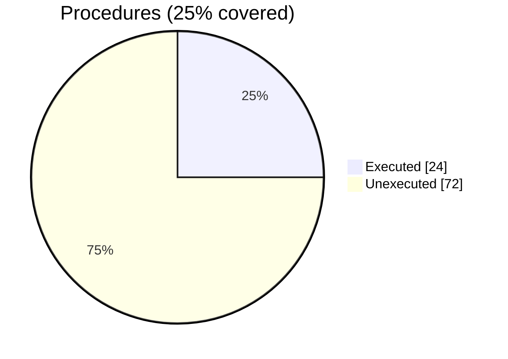


#### [[vtk_fortran_use_module_basic.f90.gcov]]

|Lines| | |
| --- | --- | --- |
|Executable lines            |5| |
|Executed lines              |5|100%|
|Unexecuted lines            |0|0%|
|Average hits / executed     |1.4| |


#### [[vtk_fortran_dataarray_encoder.f90.gcov]]

|Lines| | |
| --- | --- | --- |
|Executable lines            |938| |
|Executed lines              |145|15%|
|Unexecuted lines            |793|85%|
|Average hits / executed     |1558.3241379310346| |

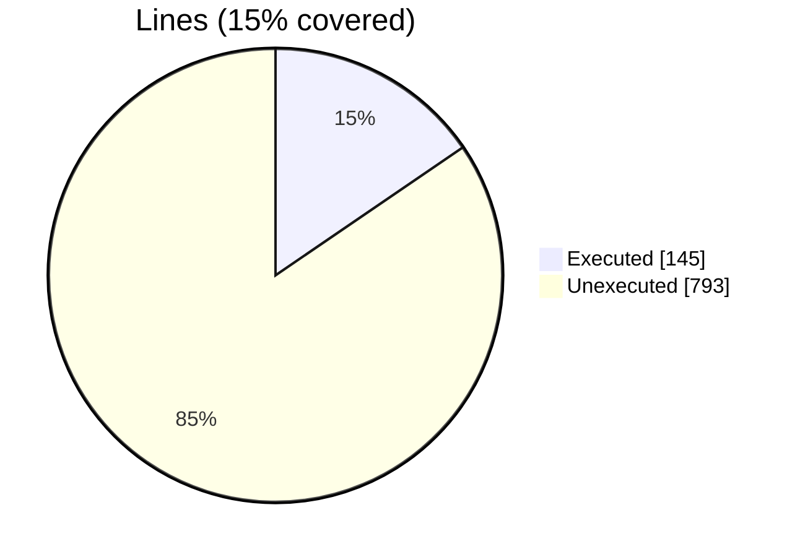

|Procedures| | |
| --- | --- | --- |
|Total procedures            |97| |
|Executed procedures         |18|19%|
|Unexecuted procedures       |79|81%|
|Average hits / executed     |3.8333333333333335| |

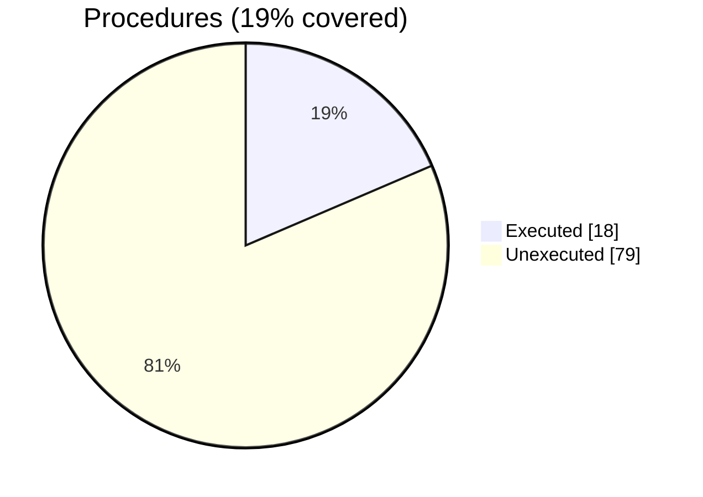


#### [[vtk_fortran_write_pvts.f90.gcov]]

|Lines| | |
| --- | --- | --- |
|Executable lines            |39| |
|Executed lines              |36|92%|
|Unexecuted lines            |3|8%|
|Average hits / executed     |88.41666666666667| |

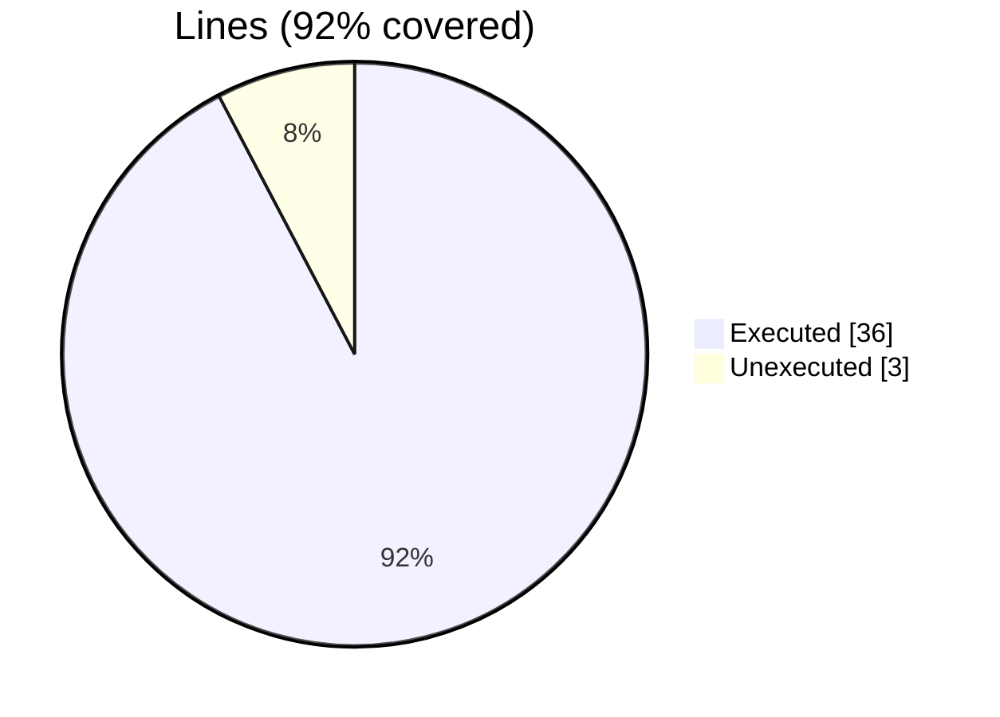

|Procedures| | |
| --- | --- | --- |
|Total procedures            |2| |
|Executed procedures         |2|100%|
|Unexecuted procedures       |0|0%|
|Average hits / executed     |1.5| |

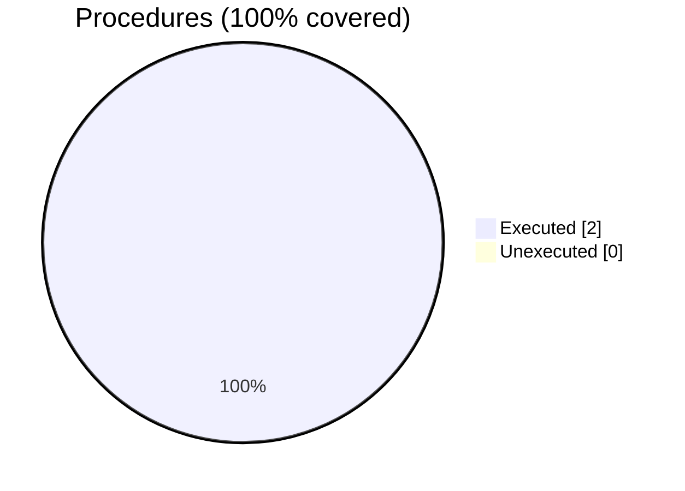


#### [[vtk_fortran_vtk_file_xml_writer_ascii_local.f90.gcov]]

|Lines| | |
| --- | --- | --- |
|Executable lines            |534| |
|Executed lines              |85|16%|
|Unexecuted lines            |449|84%|
|Average hits / executed     |2.4705882352941178| |

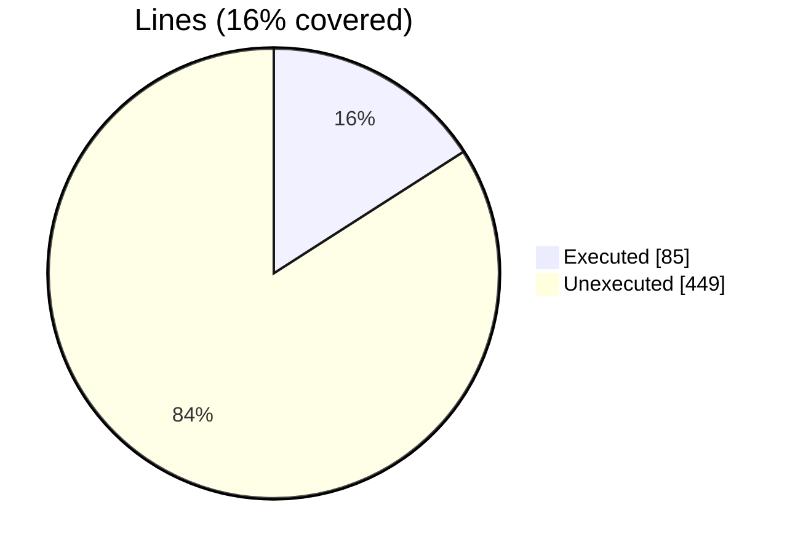

|Procedures| | |
| --- | --- | --- |
|Total procedures            |51| |
|Executed procedures         |9|18%|
|Unexecuted procedures       |42|82%|
|Average hits / executed     |2.888888888888889| |

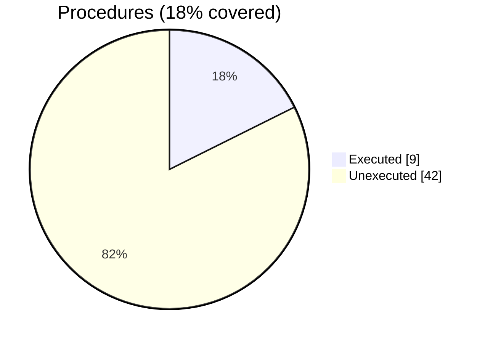


#### [[vtk_fortran_write_volatile.f90.gcov]]

|Lines| | |
| --- | --- | --- |
|Executable lines            |87| |
|Executed lines              |87|100%|
|Unexecuted lines            |0|0%|
|Average hits / executed     |548.5172413793103| |


|Procedures| | |
| --- | --- | --- |
|Total procedures            |2| |
|Executed procedures         |2|100%|
|Unexecuted procedures       |0|0%|
|Average hits / executed     |1.5| |


#### [[vtk_fortran_write_vtu_tensor.f90.gcov]]

|Lines| | |
| --- | --- | --- |
|Executable lines            |34| |
|Executed lines              |34|100%|
|Unexecuted lines            |0|0%|
|Average hits / executed     |2.3823529411764706| |

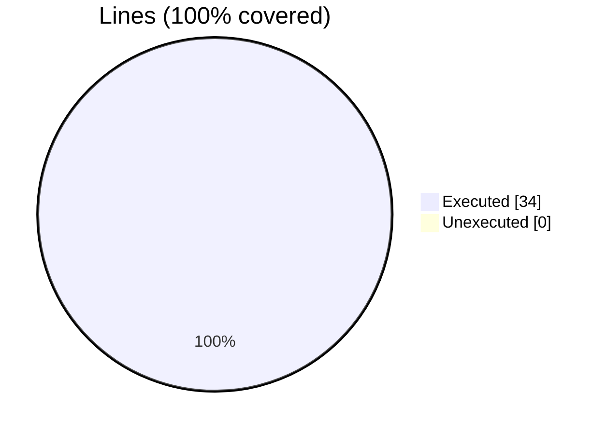

|Procedures| | |
| --- | --- | --- |
|Total procedures            |1| |
|Executed procedures         |1|100%|
|Unexecuted procedures       |0|0%|
|Average hits / executed     |3.0| |


#### [[vtk_fortran_write_vtr.f90.gcov]]

|Lines| | |
| --- | --- | --- |
|Executable lines            |32| |
|Executed lines              |32|100%|
|Unexecuted lines            |0|0%|
|Average hits / executed     |495.03125| |


#### [[vtk_fortran_vtk_file_xml_writer_binary_local.f90.gcov]]

|Lines| | |
| --- | --- | --- |
|Executable lines            |535| |
|Executed lines              |129|24%|
|Unexecuted lines            |406|76%|
|Average hits / executed     |4.790697674418604| |

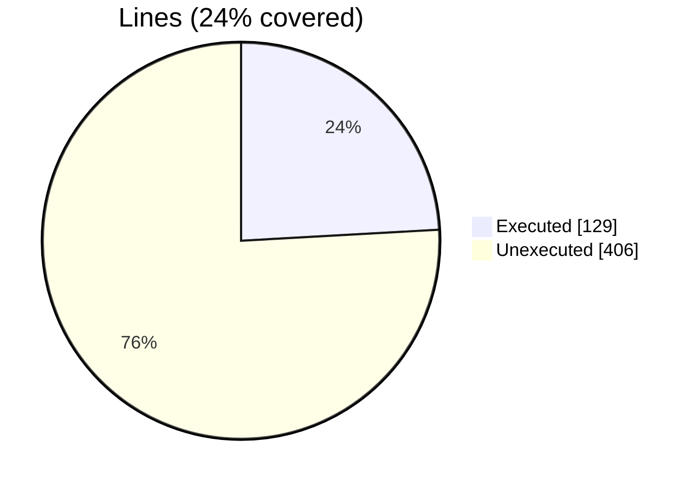

|Procedures| | |
| --- | --- | --- |
|Total procedures            |51| |
|Executed procedures         |13|25%|
|Unexecuted procedures       |38|75%|
|Average hits / executed     |5.3076923076923075| |

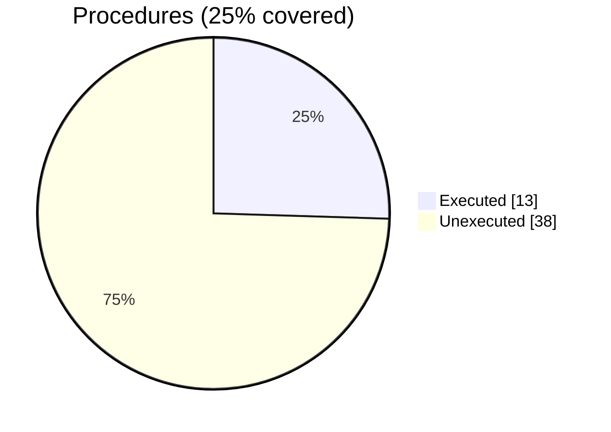


#### [[vtk_fortran_vtk_file_xml_writer_abstract.f90.gcov]]

|Lines| | |
| --- | --- | --- |
|Executable lines            |340| |
|Executed lines              |218|64%|
|Unexecuted lines            |122|36%|
|Average hits / executed     |23.88532110091743| |

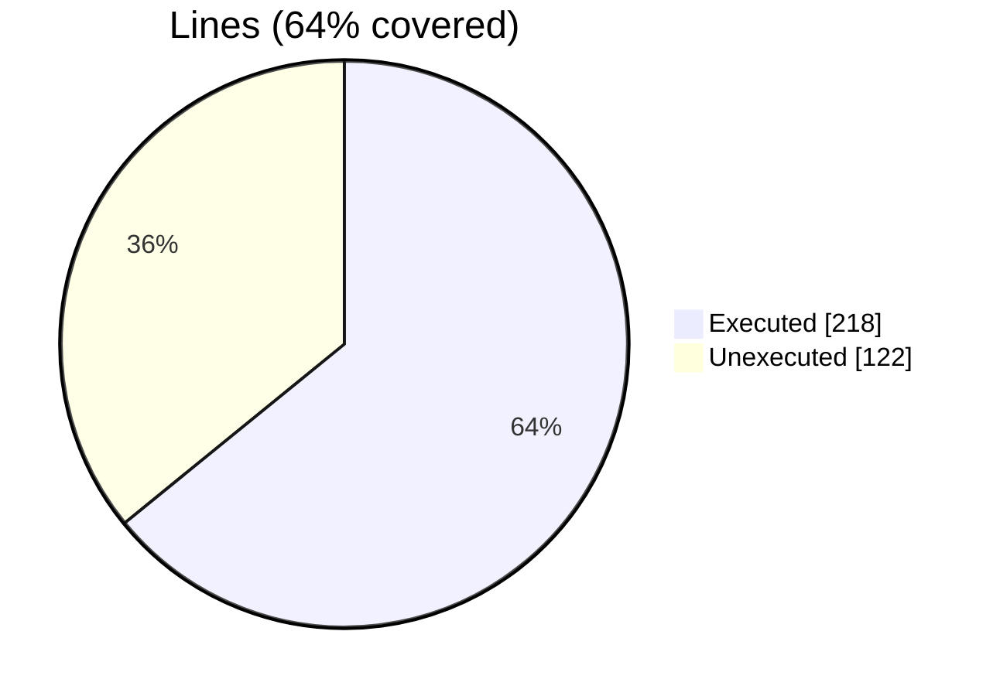

|Procedures| | |
| --- | --- | --- |
|Total procedures            |40| |
|Executed procedures         |28|70%|
|Unexecuted procedures       |12|30%|
|Average hits / executed     |21.75| |

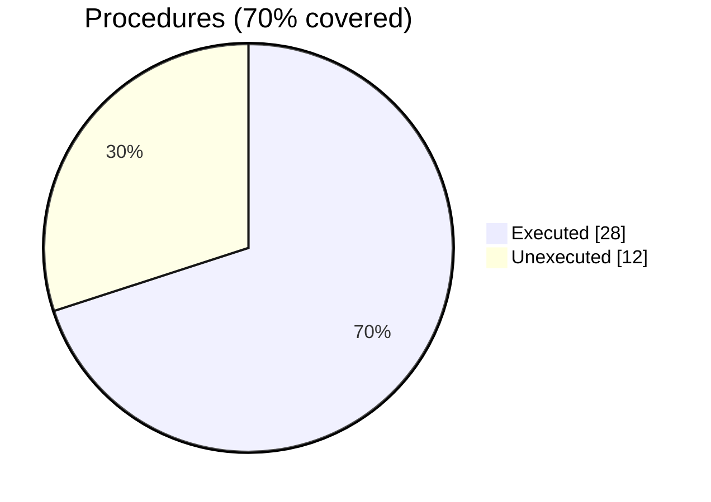


#### [[vtk_fortran_vtm_file.F90.gcov]]

|Lines| | |
| --- | --- | --- |
|Executable lines            |62| |
|Executed lines              |27|44%|
|Unexecuted lines            |35|56%|
|Average hits / executed     |1.4444444444444444| |

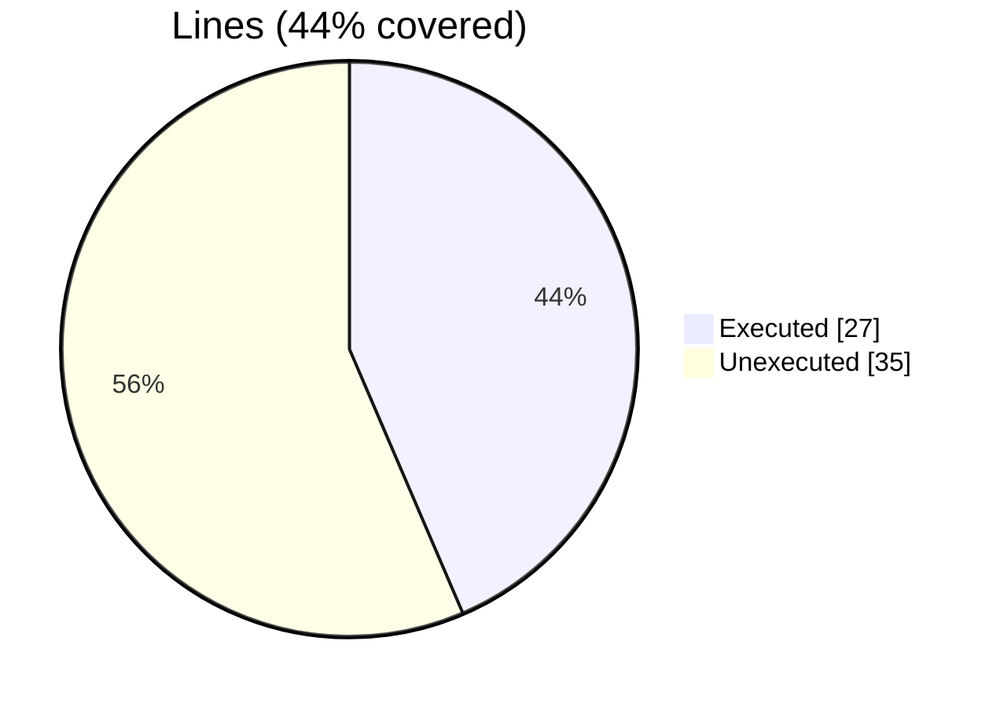

|Procedures| | |
| --- | --- | --- |
|Total procedures            |6| |
|Executed procedures         |4|67%|
|Unexecuted procedures       |2|33%|
|Average hits / executed     |1.5| |

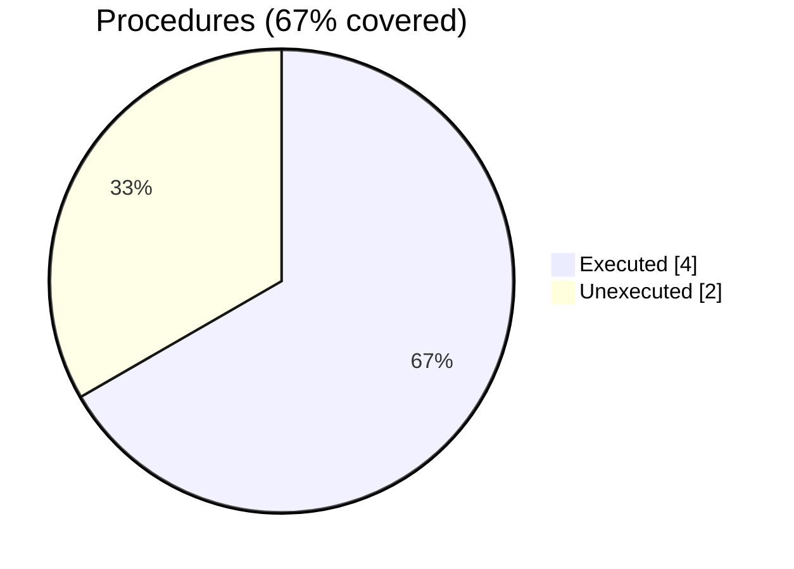


#### [[vtk_fortran_pvtk_file.f90.gcov]]

|Lines| | |
| --- | --- | --- |
|Executable lines            |13| |
|Executed lines              |11|85%|
|Unexecuted lines            |2|15%|
|Average hits / executed     |1.4545454545454546| |

```mermaid
pie showData
    title Lines (85% covered)
    "Executed" : 11
    "Unexecuted" : 2
```

|Procedures| | |
| --- | --- | --- |
|Total procedures            |2| |
|Executed procedures         |2|100%|
|Unexecuted procedures       |0|0%|
|Average hits / executed     |1.0| |

```mermaid
pie showData
    title Procedures (100% covered)
    "Executed" : 2
    "Unexecuted" : 0
```


#### [[vtk_fortran_vtk_file.f90.gcov]]

|Lines| | |
| --- | --- | --- |
|Executable lines            |26| |
|Executed lines              |25|96%|
|Unexecuted lines            |1|4%|
|Average hits / executed     |17.2| |

```mermaid
pie showData
    title Lines (96% covered)
    "Executed" : 25
    "Unexecuted" : 1
```

|Procedures| | |
| --- | --- | --- |
|Total procedures            |4| |
|Executed procedures         |4|100%|
|Unexecuted procedures       |0|0%|
|Average hits / executed     |10.25| |

```mermaid
pie showData
    title Procedures (100% covered)
    "Executed" : 4
    "Unexecuted" : 0
```


#### [[vtk_fortran.f90.gcov]]

|Lines| | |
| --- | --- | --- |
|Executable lines            |4| |
|Executed lines              |4|100%|
|Unexecuted lines            |0|0%|
|Average hits / executed     |2.0| |

```mermaid
pie showData
    title Lines (100% covered)
    "Executed" : 4
    "Unexecuted" : 0
```

|Procedures| | |
| --- | --- | --- |
|Total procedures            |1| |
|Executed procedures         |1|100%|
|Unexecuted procedures       |0|0%|
|Average hits / executed     |2.0| |

```mermaid
pie showData
    title Procedures (100% covered)
    "Executed" : 1
    "Unexecuted" : 0
```


#### [[vtk_fortran_write_vtm.f90.gcov]]

|Lines| | |
| --- | --- | --- |
|Executable lines            |39| |
|Executed lines              |39|100%|
|Unexecuted lines            |0|0%|
|Average hits / executed     |175.53846153846155| |

```mermaid
pie showData
    title Lines (100% covered)
    "Executed" : 39
    "Unexecuted" : 0
```

|Procedures| | |
| --- | --- | --- |
|Total procedures            |1| |
|Executed procedures         |1|100%|
|Unexecuted procedures       |0|0%|
|Average hits / executed     |4.0| |

```mermaid
pie showData
    title Procedures (100% covered)
    "Executed" : 1
    "Unexecuted" : 0
```


#### [[vtk_fortran_write_vtu.f90.gcov]]

|Lines| | |
| --- | --- | --- |
|Executable lines            |38| |
|Executed lines              |38|100%|
|Unexecuted lines            |0|0%|
|Average hits / executed     |4.421052631578948| |

```mermaid
pie showData
    title Lines (100% covered)
    "Executed" : 38
    "Unexecuted" : 0
```

|Procedures| | |
| --- | --- | --- |
|Total procedures            |1| |
|Executed procedures         |1|100%|
|Unexecuted procedures       |0|0%|
|Average hits / executed     |3.0| |

```mermaid
pie showData
    title Procedures (100% covered)
    "Executed" : 1
    "Unexecuted" : 0
```


#### [[vtk_fortran_write_vts.f90.gcov]]

|Lines| | |
| --- | --- | --- |
|Executable lines            |31| |
|Executed lines              |31|100%|
|Unexecuted lines            |0|0%|
|Average hits / executed     |115.12903225806451| |

```mermaid
pie showData
    title Lines (100% covered)
    "Executed" : 31
    "Unexecuted" : 0
```

|Procedures| | |
| --- | --- | --- |
|Total procedures            |1| |
|Executed procedures         |1|100%|
|Unexecuted procedures       |0|0%|
|Average hits / executed     |2.0| |

```mermaid
pie showData
    title Procedures (100% covered)
    "Executed" : 1
    "Unexecuted" : 0
```

