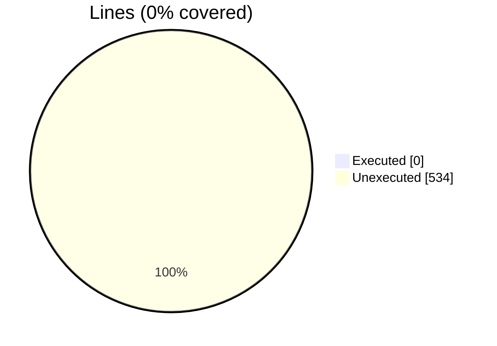
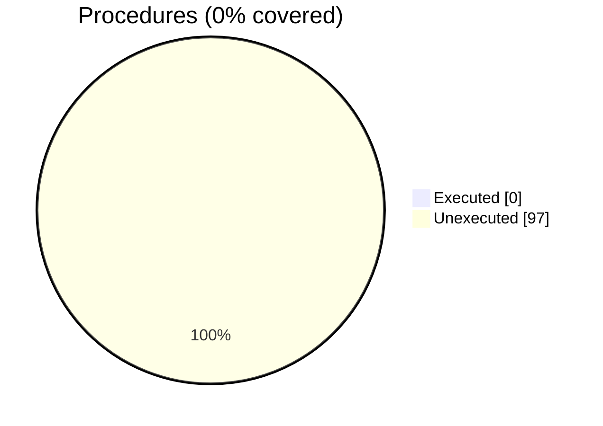
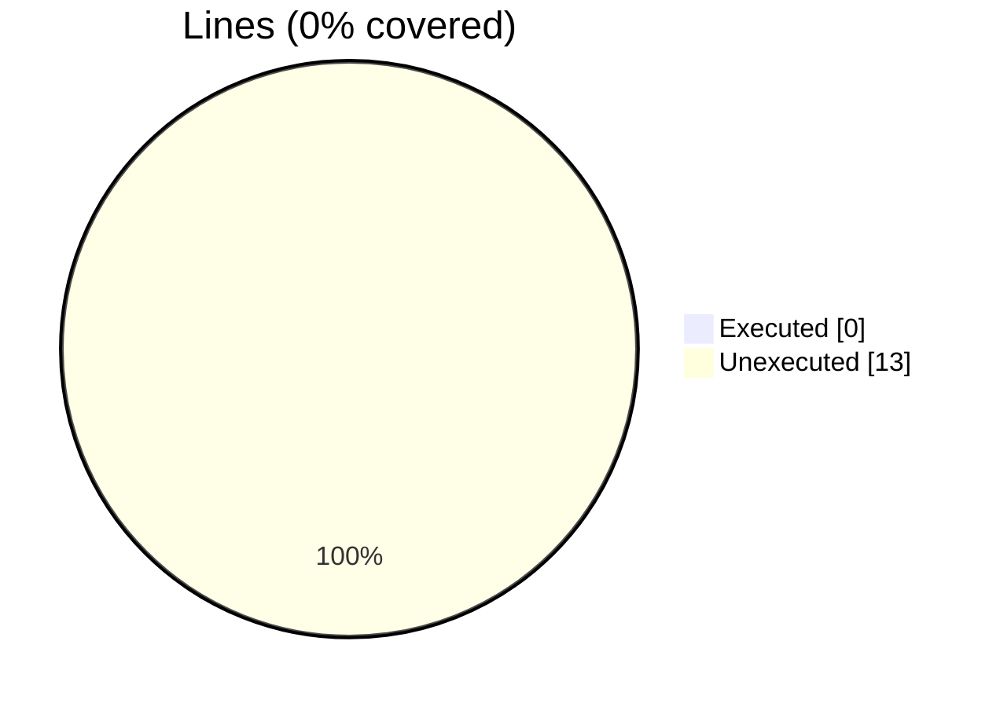
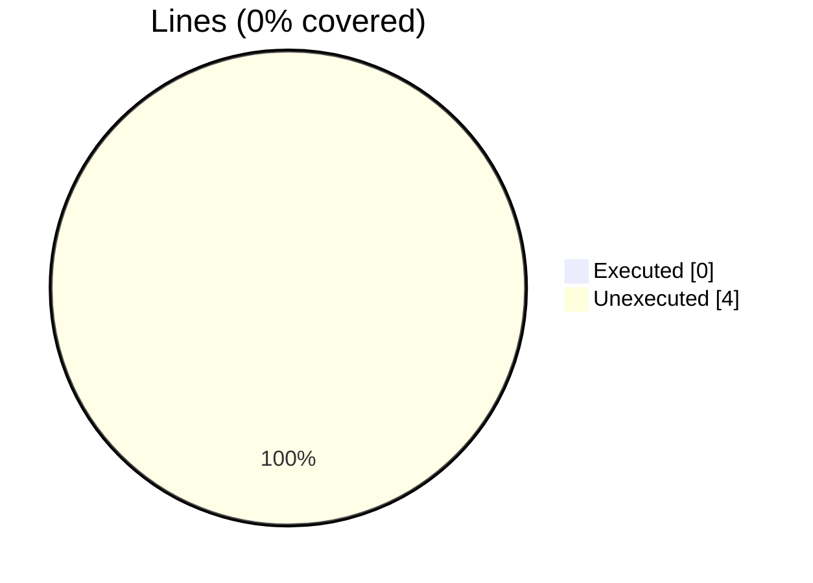

# Coverage Analysis

#### [[vtk_fortran_vtk_file_xml_writer_binary_local.f90.gcov]]

|Lines| | |
| --- | --- | --- |
|Executable lines            |535| |
|Executed lines              |0|0%|
|Unexecuted lines            |535|100%|
|Average hits / executed     |0| |

|Procedures| | |
| --- | --- | --- |
|Total procedures            |51| |
|Executed procedures         |0|0%|
|Unexecuted procedures       |51|100%|
|Average hits / executed     |0| |

#### [[vtk_fortran_vtk_file_xml_writer_ascii_local.f90.gcov]]

|Lines| | |
| --- | --- | --- |
|Executable lines            |534| |
|Executed lines              |0|0%|
|Unexecuted lines            |534|100%|
|Average hits / executed     |0| |

|Procedures| | |
| --- | --- | --- |
|Total procedures            |51| |
|Executed procedures         |0|0%|
|Unexecuted procedures       |51|100%|
|Average hits / executed     |0| |

#### [[vtk_fortran_vtk_file.f90.gcov]]

|Lines| | |
| --- | --- | --- |
|Executable lines            |26| |
|Executed lines              |0|0%|
|Unexecuted lines            |26|100%|
|Average hits / executed     |0| |

|Procedures| | |
| --- | --- | --- |
|Total procedures            |4| |
|Executed procedures         |0|0%|
|Unexecuted procedures       |4|100%|
|Average hits / executed     |0| |

#### [[vtk_fortran_dataarray_encoder.f90.gcov]]

|Lines| | |
| --- | --- | --- |
|Executable lines            |938| |
|Executed lines              |0|0%|
|Unexecuted lines            |938|100%|
|Average hits / executed     |0| |

|Procedures| | |
| --- | --- | --- |
|Total procedures            |97| |
|Executed procedures         |0|0%|
|Unexecuted procedures       |97|100%|
|Average hits / executed     |0| |

#### [[vtk_fortran_pvtk_file.f90.gcov]]

|Lines| | |
| --- | --- | --- |
|Executable lines            |13| |
|Executed lines              |0|0%|
|Unexecuted lines            |13|100%|
|Average hits / executed     |0| |

|Procedures| | |
| --- | --- | --- |
|Total procedures            |2| |
|Executed procedures         |0|0%|
|Unexecuted procedures       |2|100%|
|Average hits / executed     |0| |

#### [[vtk_fortran_vtk_file_xml_writer_appended.f90.gcov]]

|Lines| | |
| --- | --- | --- |
|Executable lines            |782| |
|Executed lines              |0|0%|
|Unexecuted lines            |782|100%|
|Average hits / executed     |0| |

|Procedures| | |
| --- | --- | --- |
|Total procedures            |96| |
|Executed procedures         |0|0%|
|Unexecuted procedures       |96|100%|
|Average hits / executed     |0| |

#### [[vtk_fortran_vtk_file_xml_writer_abstract.f90.gcov]]

|Lines| | |
| --- | --- | --- |
|Executable lines            |340| |
|Executed lines              |0|0%|
|Unexecuted lines            |340|100%|
|Average hits / executed     |0| |

|Procedures| | |
| --- | --- | --- |
|Total procedures            |40| |
|Executed procedures         |0|0%|
|Unexecuted procedures       |40|100%|
|Average hits / executed     |0| |

#### [[vtk_fortran.f90.gcov]]

|Lines| | |
| --- | --- | --- |
|Executable lines            |4| |
|Executed lines              |0|0%|
|Unexecuted lines            |4|100%|
|Average hits / executed     |0| |

|Procedures| | |
| --- | --- | --- |
|Total procedures            |1| |
|Executed procedures         |0|0%|
|Unexecuted procedures       |1|100%|
|Average hits / executed     |0| |

