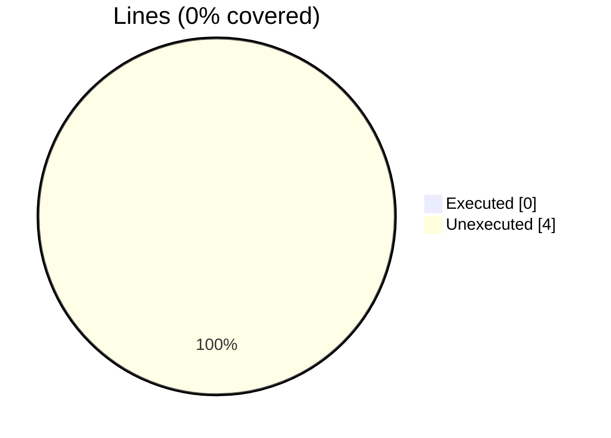
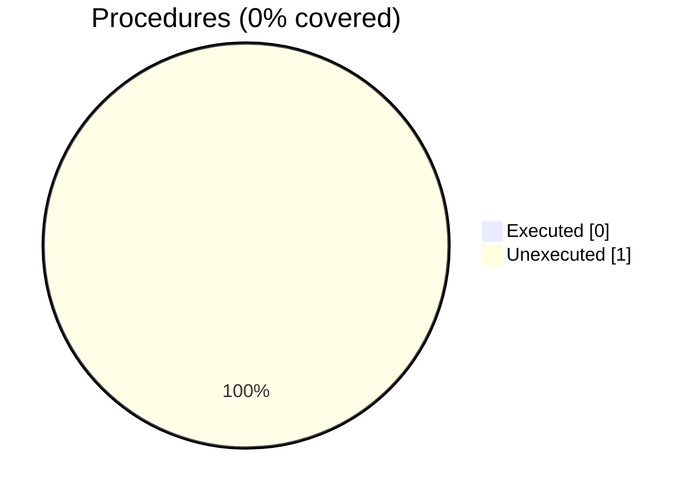

### Coverage analysis of *vtk_fortran.f90*

|Lines| | |
| --- | --- | --- |
|Executable lines            |4| |
|Executed lines              |0|0%|
|Unexecuted lines            |4|100%|
|Average hits / executed     |0| |

|Procedures| | |
| --- | --- | --- |
|Total procedures            |1| |
|Executed procedures         |0|0%|
|Unexecuted procedures       |1|100%|
|Average hits / executed     |0| |

#### Unexecuted procedures

 + *function* **write_xml_volatile**, line 17

#### Executed procedures

 + *none*

 --- 
 Report generated by [FoBiS.py](https://github.com/szaghi/FoBiS)