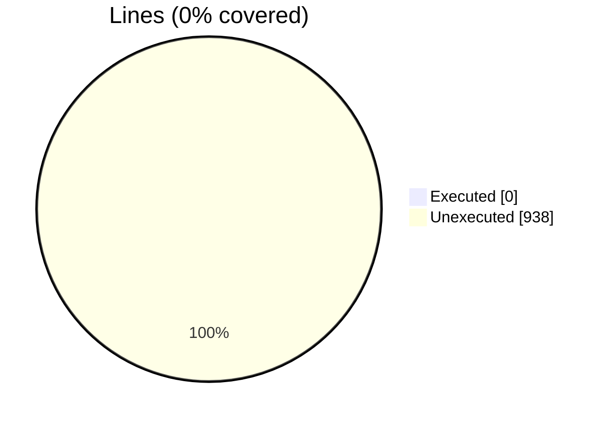
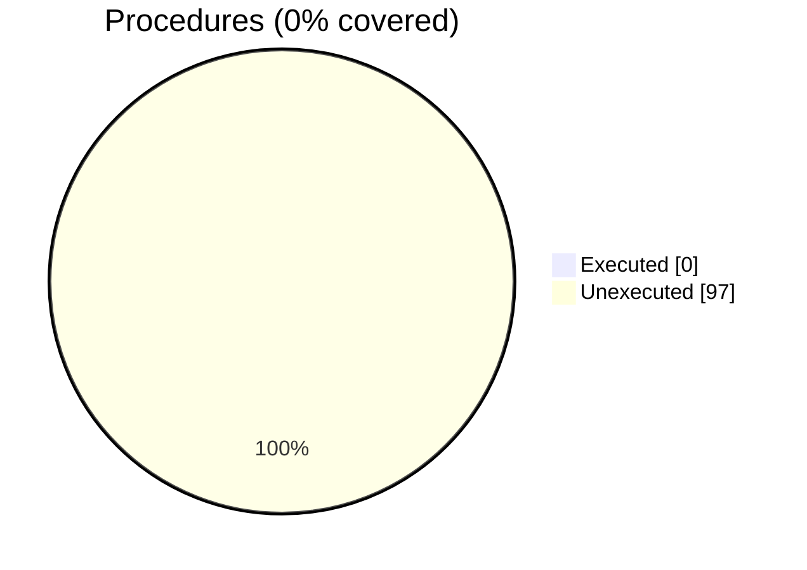

### Coverage analysis of *vtk_fortran_dataarray_encoder.f90*

|Lines| | |
| --- | --- | --- |
|Executable lines            |938| |
|Executed lines              |0|0%|
|Unexecuted lines            |938|100%|
|Average hits / executed     |0| |

|Procedures| | |
| --- | --- | --- |
|Total procedures            |97| |
|Executed procedures         |0|0%|
|Unexecuted procedures       |97|100%|
|Average hits / executed     |0| |

#### Unexecuted procedures

 + *function* **encode_ascii_dataarray1_rank1_I1P**, line 230
 + *function* **encode_ascii_dataarray1_rank1_I2P**, line 211
 + *function* **encode_ascii_dataarray1_rank1_I4P**, line 192
 + *function* **encode_ascii_dataarray1_rank1_I8P**, line 173
 + *function* **encode_ascii_dataarray1_rank1_R16P**, line 116
 + *function* **encode_ascii_dataarray1_rank1_R4P**, line 154
 + *function* **encode_ascii_dataarray1_rank1_R8P**, line 135
 + *function* **encode_ascii_dataarray1_rank2_I1P**, line 405
 + *function* **encode_ascii_dataarray1_rank2_I2P**, line 379
 + *function* **encode_ascii_dataarray1_rank2_I4P**, line 353
 + *function* **encode_ascii_dataarray1_rank2_I8P**, line 327
 + *function* **encode_ascii_dataarray1_rank2_R4P**, line 301
 + *function* **encode_ascii_dataarray1_rank2_R8P**, line 275
 + *function* **encode_ascii_dataarray1_rank3_I1P**, line 622
 + *function* **encode_ascii_dataarray1_rank3_I2P**, line 590
 + *function* **encode_ascii_dataarray1_rank3_I4P**, line 558
 + *function* **encode_ascii_dataarray1_rank3_I8P**, line 526
 + *function* **encode_ascii_dataarray1_rank3_R4P**, line 494
 + *function* **encode_ascii_dataarray1_rank3_R8P**, line 462
 + *function* **encode_ascii_dataarray1_rank4_I1P**, line 864
 + *function* **encode_ascii_dataarray1_rank4_I2P**, line 829
 + *function* **encode_ascii_dataarray1_rank4_I4P**, line 794
 + *function* **encode_ascii_dataarray1_rank4_I8P**, line 759
 + *function* **encode_ascii_dataarray1_rank4_R4P**, line 724
 + *function* **encode_ascii_dataarray1_rank4_R8P**, line 689
 + *function* **encode_ascii_dataarray3_rank1_I1P**, line 1025
 + *function* **encode_ascii_dataarray3_rank1_I2P**, line 1004
 + *function* **encode_ascii_dataarray3_rank1_I4P**, line 983
 + *function* **encode_ascii_dataarray3_rank1_I8P**, line 962
 + *function* **encode_ascii_dataarray3_rank1_R4P**, line 941
 + *function* **encode_ascii_dataarray3_rank1_R8P**, line 920
 + *function* **encode_ascii_dataarray3_rank3_I1P**, line 1238
 + *function* **encode_ascii_dataarray3_rank3_I2P**, line 1206
 + *function* **encode_ascii_dataarray3_rank3_I4P**, line 1174
 + *function* **encode_ascii_dataarray3_rank3_I8P**, line 1142
 + *function* **encode_ascii_dataarray3_rank3_R4P**, line 1110
 + *function* **encode_ascii_dataarray3_rank3_R8P**, line 1078
 + *function* **encode_ascii_dataarray6_rank1_I1P**, line 1420
 + *function* **encode_ascii_dataarray6_rank1_I2P**, line 1395
 + *function* **encode_ascii_dataarray6_rank1_I4P**, line 1370
 + *function* **encode_ascii_dataarray6_rank1_I8P**, line 1345
 + *function* **encode_ascii_dataarray6_rank1_R4P**, line 1320
 + *function* **encode_ascii_dataarray6_rank1_R8P**, line 1295
 + *function* **encode_ascii_dataarray6_rank3_I1P**, line 1661
 + *function* **encode_ascii_dataarray6_rank3_I2P**, line 1625
 + *function* **encode_ascii_dataarray6_rank3_I4P**, line 1589
 + *function* **encode_ascii_dataarray6_rank3_I8P**, line 1553
 + *function* **encode_ascii_dataarray6_rank3_R4P**, line 1517
 + *function* **encode_ascii_dataarray6_rank3_R8P**, line 1481
 + *function* **encode_binary_dataarray1_rank1_I1P**, line 1758
 + *function* **encode_binary_dataarray1_rank1_I2P**, line 1746
 + *function* **encode_binary_dataarray1_rank1_I4P**, line 1734
 + *function* **encode_binary_dataarray1_rank1_I8P**, line 1722
 + *function* **encode_binary_dataarray1_rank1_R4P**, line 1710
 + *function* **encode_binary_dataarray1_rank1_R8P**, line 1698
 + *function* **encode_binary_dataarray1_rank2_I1P**, line 1830
 + *function* **encode_binary_dataarray1_rank2_I2P**, line 1818
 + *function* **encode_binary_dataarray1_rank2_I4P**, line 1806
 + *function* **encode_binary_dataarray1_rank2_I8P**, line 1794
 + *function* **encode_binary_dataarray1_rank2_R4P**, line 1782
 + *function* **encode_binary_dataarray1_rank2_R8P**, line 1770
 + *function* **encode_binary_dataarray1_rank3_I1P**, line 1902
 + *function* **encode_binary_dataarray1_rank3_I2P**, line 1890
 + *function* **encode_binary_dataarray1_rank3_I4P**, line 1878
 + *function* **encode_binary_dataarray1_rank3_I8P**, line 1866
 + *function* **encode_binary_dataarray1_rank3_R4P**, line 1854
 + *function* **encode_binary_dataarray1_rank3_R8P**, line 1842
 + *function* **encode_binary_dataarray1_rank4_I1P**, line 1974
 + *function* **encode_binary_dataarray1_rank4_I2P**, line 1962
 + *function* **encode_binary_dataarray1_rank4_I4P**, line 1950
 + *function* **encode_binary_dataarray1_rank4_I8P**, line 1938
 + *function* **encode_binary_dataarray1_rank4_R4P**, line 1926
 + *function* **encode_binary_dataarray1_rank4_R8P**, line 1914
 + *function* **encode_binary_dataarray3_rank1_I1P**, line 2061
 + *function* **encode_binary_dataarray3_rank1_I2P**, line 2046
 + *function* **encode_binary_dataarray3_rank1_I4P**, line 2031
 + *function* **encode_binary_dataarray3_rank1_I8P**, line 2016
 + *function* **encode_binary_dataarray3_rank1_R4P**, line 2001
 + *function* **encode_binary_dataarray3_rank1_R8P**, line 1986
 + *function* **encode_binary_dataarray3_rank3_I1P**, line 2205
 + *function* **encode_binary_dataarray3_rank3_I2P**, line 2179
 + *function* **encode_binary_dataarray3_rank3_I4P**, line 2154
 + *function* **encode_binary_dataarray3_rank3_I8P**, line 2128
 + *function* **encode_binary_dataarray3_rank3_R4P**, line 2102
 + *function* **encode_binary_dataarray3_rank3_R8P**, line 2076
 + *function* **encode_binary_dataarray6_rank1_I1P**, line 2321
 + *function* **encode_binary_dataarray6_rank1_I2P**, line 2303
 + *function* **encode_binary_dataarray6_rank1_I4P**, line 2285
 + *function* **encode_binary_dataarray6_rank1_I8P**, line 2267
 + *function* **encode_binary_dataarray6_rank1_R4P**, line 2249
 + *function* **encode_binary_dataarray6_rank1_R8P**, line 2231
 + *function* **encode_binary_dataarray6_rank3_I1P**, line 2488
 + *function* **encode_binary_dataarray6_rank3_I2P**, line 2458
 + *function* **encode_binary_dataarray6_rank3_I4P**, line 2429
 + *function* **encode_binary_dataarray6_rank3_I8P**, line 2399
 + *function* **encode_binary_dataarray6_rank3_R4P**, line 2369
 + *function* **encode_binary_dataarray6_rank3_R8P**, line 2339

#### Executed procedures

 + *none*

 --- 
 Report generated by [FoBiS.py](https://github.com/szaghi/FoBiS)