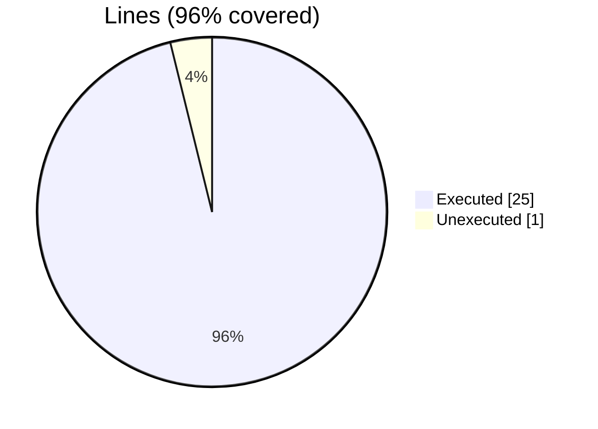
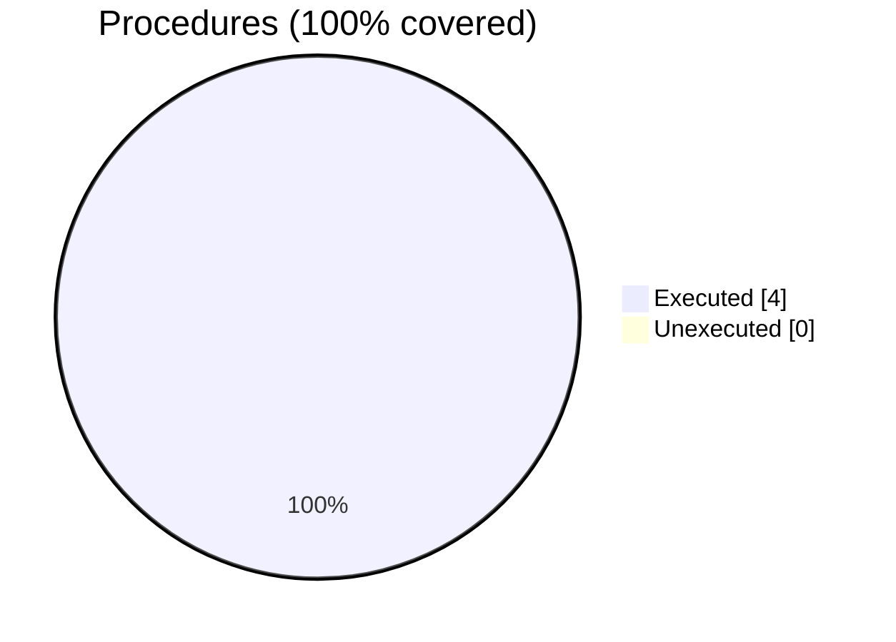

### Coverage analysis of *vtk_fortran_vtk_file.f90*

|Lines| | |
| --- | --- | --- |
|Executable lines            |26| |
|Executed lines              |25|96%|
|Unexecuted lines            |1|4%|
|Average hits / executed     |17.2| |

|Procedures| | |
| --- | --- | --- |
|Total procedures            |4| |
|Executed procedures         |4|100%|
|Unexecuted procedures       |0|0%|
|Average hits / executed     |10.25| |

#### Unexecuted procedures

 + *none*

#### Executed procedures

 + *function* **initialize**: tested **18** times
 + *function* **finalize**: tested **18** times
 + *subroutine* **free**: tested **3** times
 + *subroutine* **get_xml_volatile**: tested **2** times

 --- 
 Report generated by [FoBiS.py](https://github.com/szaghi/FoBiS)