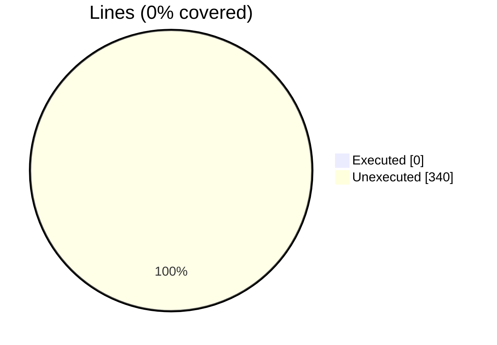
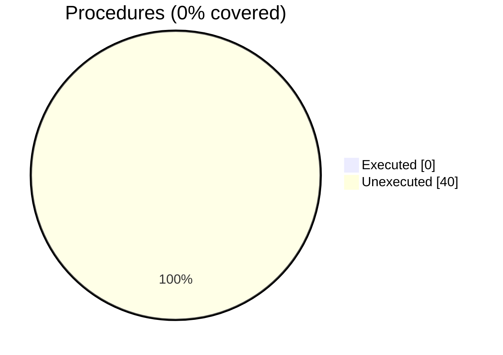

### Coverage analysis of *vtk_fortran_vtk_file_xml_writer_abstract.f90*

|Lines| | |
| --- | --- | --- |
|Executable lines            |340| |
|Executed lines              |0|0%|
|Unexecuted lines            |340|100%|
|Average hits / executed     |0| |

|Procedures| | |
| --- | --- | --- |
|Total procedures            |40| |
|Executed procedures         |0|0%|
|Unexecuted procedures       |40|100%|
|Average hits / executed     |0| |

#### Unexecuted procedures

 + *function* **write_connectivity**, line 1437
 + *function* **write_dataarray_location_tag**, line 1056
 + *function* **write_fielddata1_rank0**, line 1115
 + *function* **write_fielddata_tag**, line 1139
 + *function* **write_geo_rect_data3_rank1_R4P**, line 1215
 + *function* **write_geo_rect_data3_rank1_R8P**, line 1199
 + *function* **write_geo_strg_data1_rank2_R4P**, line 1244
 + *function* **write_geo_strg_data1_rank2_R8P**, line 1232
 + *function* **write_geo_strg_data1_rank4_R4P**, line 1268
 + *function* **write_geo_strg_data1_rank4_R8P**, line 1256
 + *function* **write_geo_strg_data3_rank1_R4P**, line 1299
 + *function* **write_geo_strg_data3_rank1_R8P**, line 1280
 + *function* **write_geo_strg_data3_rank3_R4P**, line 1339
 + *function* **write_geo_strg_data3_rank3_R8P**, line 1318
 + *function* **write_geo_unst_data1_rank2_R4P**, line 1379
 + *function* **write_geo_unst_data1_rank2_R8P**, line 1361
 + *function* **write_geo_unst_data3_rank1_R4P**, line 1417
 + *function* **write_geo_unst_data3_rank1_R8P**, line 1397
 + *function* **write_parallel_block_file**, line 1585
 + *function* **write_parallel_block_files_array**, line 1606
 + *function* **write_parallel_block_files_string**, line 1644
 + *function* **write_parallel_close_block**, line 1530
 + *function* **write_parallel_dataarray**, line 1540
 + *function* **write_parallel_geo**, line 1559
 + *function* **write_parallel_open_block**, line 1513
 + *function* **write_piece_end_tag**, line 1189
 + *function* **write_piece_start_tag**, line 1157
 + *function* **write_piece_start_tag_unst**, line 1176
 + *subroutine* **close_xml_file**, line 815
 + *subroutine* **free**, line 840
 + *subroutine* **get_xml_volatile**, line 857
 + *subroutine* **open_xml_file**, line 822
 + *subroutine* **write_dataarray_tag**, line 1001
 + *subroutine* **write_dataarray_tag_appended**, line 1028
 + *subroutine* **write_end_tag**, line 869
 + *subroutine* **write_header_tag**, line 883
 + *subroutine* **write_self_closing_tag**, line 902
 + *subroutine* **write_start_tag**, line 917
 + *subroutine* **write_tag**, line 932
 + *subroutine* **write_topology_tag**, line 948

#### Executed procedures

 + *none*

 --- 
 Report generated by [FoBiS.py](https://github.com/szaghi/FoBiS)