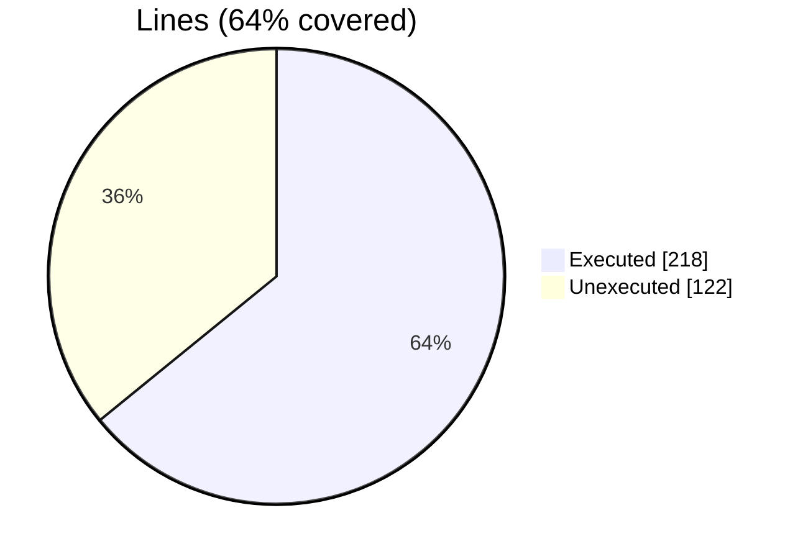
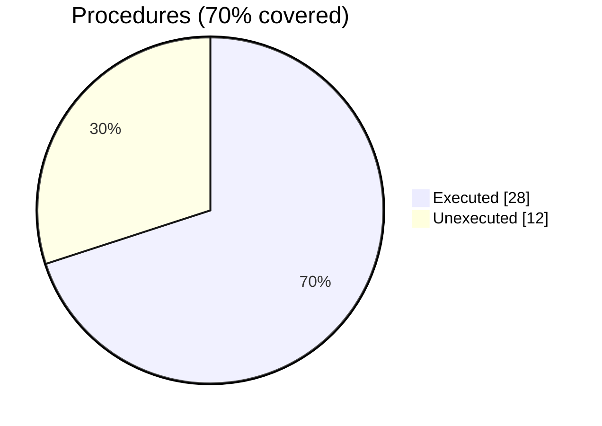

### Coverage analysis of *vtk_fortran_vtk_file_xml_writer_abstract.f90*

|Lines| | |
| --- | --- | --- |
|Executable lines            |340| |
|Executed lines              |218|64%|
|Unexecuted lines            |122|36%|
|Average hits / executed     |23.88532110091743| |

|Procedures| | |
| --- | --- | --- |
|Total procedures            |40| |
|Executed procedures         |28|70%|
|Unexecuted procedures       |12|30%|
|Average hits / executed     |21.75| |

#### Unexecuted procedures

 + *function* **write_geo_rect_data3_rank1_R4P**, line 1215
 + *function* **write_geo_strg_data1_rank2_R4P**, line 1244
 + *function* **write_geo_strg_data1_rank2_R8P**, line 1232
 + *function* **write_geo_strg_data1_rank4_R4P**, line 1268
 + *function* **write_geo_strg_data1_rank4_R8P**, line 1256
 + *function* **write_geo_strg_data3_rank1_R4P**, line 1299
 + *function* **write_geo_strg_data3_rank1_R8P**, line 1280
 + *function* **write_geo_strg_data3_rank3_R4P**, line 1339
 + *function* **write_geo_unst_data1_rank2_R4P**, line 1379
 + *function* **write_geo_unst_data1_rank2_R8P**, line 1361
 + *function* **write_geo_unst_data3_rank1_R8P**, line 1397
 + *function* **write_parallel_block_file**, line 1585

#### Executed procedures

 + *subroutine* **write_end_tag**: tested **115** times
 + *subroutine* **write_start_tag**: tested **95** times
 + *subroutine* **write_tag**: tested **56** times
 + *subroutine* **write_dataarray_tag**: tested **56** times
 + *function* **write_dataarray_location_tag**: tested **38** times
 + *subroutine* **write_self_closing_tag**: tested **31** times
 + *subroutine* **write_dataarray_tag_appended**: tested **23** times
 + *subroutine* **close_xml_file**: tested **20** times
 + *subroutine* **open_xml_file**: tested **20** times
 + *subroutine* **write_header_tag**: tested **20** times
 + *subroutine* **write_topology_tag**: tested **20** times
 + *function* **write_piece_end_tag**: tested **18** times
 + *function* **write_geo_strg_data3_rank3_R8P**: tested **16** times
 + *function* **write_piece_start_tag**: tested **12** times
 + *function* **write_geo_unst_data3_rank1_R4P**: tested **12** times
 + *function* **write_connectivity**: tested **12** times
 + *function* **write_fielddata1_rank0**: tested **8** times
 + *function* **write_fielddata_tag**: tested **8** times
 + *function* **write_geo_rect_data3_rank1_R8P**: tested **8** times
 + *function* **write_piece_start_tag_unst**: tested **6** times
 + *subroutine* **free**: tested **3** times
 + *subroutine* **get_xml_volatile**: tested **2** times
 + *function* **write_parallel_open_block**: tested **2** times
 + *function* **write_parallel_close_block**: tested **2** times
 + *function* **write_parallel_geo**: tested **2** times
 + *function* **write_parallel_block_files_array**: tested **2** times
 + *function* **write_parallel_dataarray**: tested **1** times
 + *function* **write_parallel_block_files_string**: tested **1** times

 --- 
 Report generated by [FoBiS.py](https://github.com/szaghi/FoBiS)