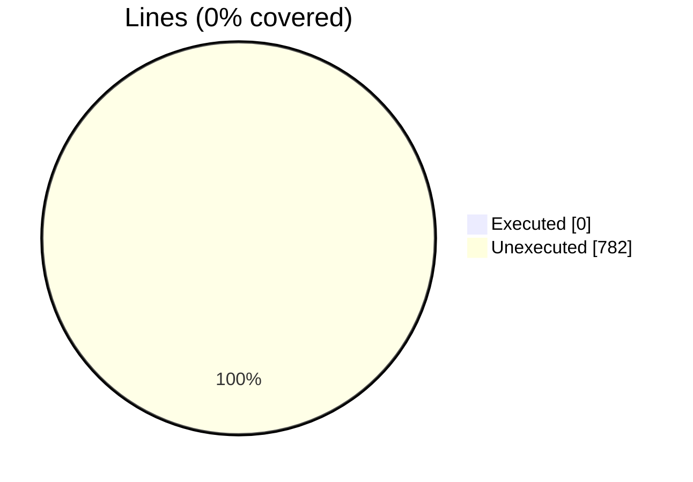
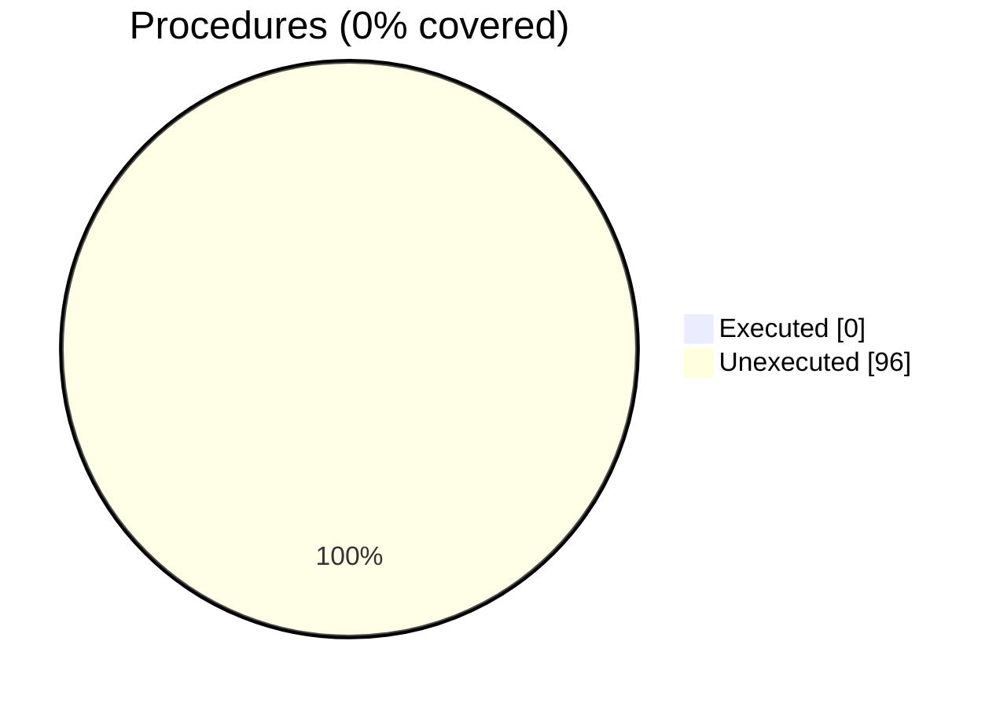

### Coverage analysis of *vtk_fortran_vtk_file_xml_writer_appended.f90*

|Lines| | |
| --- | --- | --- |
|Executable lines            |782| |
|Executed lines              |0|0%|
|Unexecuted lines            |782|100%|
|Average hits / executed     |0| |

|Procedures| | |
| --- | --- | --- |
|Total procedures            |96| |
|Executed procedures         |0|0%|
|Unexecuted procedures       |96|100%|
|Average hits / executed     |0| |

#### Unexecuted procedures

 + *function* **finalize**, line 193
 + *function* **initialize**, line 158
 + *function* **write_dataarray1_rank1_I1P**, line 328
 + *function* **write_dataarray1_rank1_I2P**, line 310
 + *function* **write_dataarray1_rank1_I4P**, line 292
 + *function* **write_dataarray1_rank1_I8P**, line 274
 + *function* **write_dataarray1_rank1_R4P**, line 256
 + *function* **write_dataarray1_rank1_R8P**, line 238
 + *function* **write_dataarray1_rank2_I1P**, line 456
 + *function* **write_dataarray1_rank2_I2P**, line 434
 + *function* **write_dataarray1_rank2_I4P**, line 412
 + *function* **write_dataarray1_rank2_I8P**, line 390
 + *function* **write_dataarray1_rank2_R4P**, line 368
 + *function* **write_dataarray1_rank2_R8P**, line 346
 + *function* **write_dataarray1_rank3_I1P**, line 588
 + *function* **write_dataarray1_rank3_I2P**, line 566
 + *function* **write_dataarray1_rank3_I4P**, line 544
 + *function* **write_dataarray1_rank3_I8P**, line 522
 + *function* **write_dataarray1_rank3_R4P**, line 500
 + *function* **write_dataarray1_rank3_R8P**, line 478
 + *function* **write_dataarray1_rank4_I1P**, line 720
 + *function* **write_dataarray1_rank4_I2P**, line 698
 + *function* **write_dataarray1_rank4_I4P**, line 676
 + *function* **write_dataarray1_rank4_I8P**, line 654
 + *function* **write_dataarray1_rank4_R4P**, line 632
 + *function* **write_dataarray1_rank4_R8P**, line 610
 + *function* **write_dataarray3_rank1_I1P**, line 842
 + *function* **write_dataarray3_rank1_I2P**, line 822
 + *function* **write_dataarray3_rank1_I4P**, line 802
 + *function* **write_dataarray3_rank1_I8P**, line 782
 + *function* **write_dataarray3_rank1_R4P**, line 762
 + *function* **write_dataarray3_rank1_R8P**, line 742
 + *function* **write_dataarray3_rank3_I1P**, line 962
 + *function* **write_dataarray3_rank3_I2P**, line 942
 + *function* **write_dataarray3_rank3_I4P**, line 922
 + *function* **write_dataarray3_rank3_I8P**, line 902
 + *function* **write_dataarray3_rank3_R4P**, line 882
 + *function* **write_dataarray3_rank3_R8P**, line 862
 + *function* **write_dataarray6_rank1_I1P**, line 1097
 + *function* **write_dataarray6_rank1_I2P**, line 1074
 + *function* **write_dataarray6_rank1_I4P**, line 1051
 + *function* **write_dataarray6_rank1_I8P**, line 1028
 + *function* **write_dataarray6_rank1_R4P**, line 1005
 + *function* **write_dataarray6_rank1_R8P**, line 982
 + *function* **write_dataarray6_rank3_I1P**, line 1235
 + *function* **write_dataarray6_rank3_I2P**, line 1212
 + *function* **write_dataarray6_rank3_I4P**, line 1189
 + *function* **write_dataarray6_rank3_I8P**, line 1166
 + *function* **write_dataarray6_rank3_R4P**, line 1143
 + *function* **write_dataarray6_rank3_R8P**, line 1120
 + *function* **write_on_scratch_dataarray1_rank1**, line 1368
 + *function* **write_on_scratch_dataarray1_rank2**, line 1404
 + *function* **write_on_scratch_dataarray1_rank3**, line 1440
 + *function* **write_on_scratch_dataarray1_rank4**, line 1476
 + *function* **write_on_scratch_dataarray3_rank1_I1P**, line 1572
 + *function* **write_on_scratch_dataarray3_rank1_I2P**, line 1560
 + *function* **write_on_scratch_dataarray3_rank1_I4P**, line 1548
 + *function* **write_on_scratch_dataarray3_rank1_I8P**, line 1536
 + *function* **write_on_scratch_dataarray3_rank1_R4P**, line 1524
 + *function* **write_on_scratch_dataarray3_rank1_R8P**, line 1512
 + *function* **write_on_scratch_dataarray3_rank2_I1P**, line 1649
 + *function* **write_on_scratch_dataarray3_rank2_I2P**, line 1636
 + *function* **write_on_scratch_dataarray3_rank2_I4P**, line 1623
 + *function* **write_on_scratch_dataarray3_rank2_I8P**, line 1610
 + *function* **write_on_scratch_dataarray3_rank2_R4P**, line 1597
 + *function* **write_on_scratch_dataarray3_rank2_R8P**, line 1584
 + *function* **write_on_scratch_dataarray3_rank3_I1P**, line 1737
 + *function* **write_on_scratch_dataarray3_rank3_I2P**, line 1722
 + *function* **write_on_scratch_dataarray3_rank3_I4P**, line 1707
 + *function* **write_on_scratch_dataarray3_rank3_I8P**, line 1692
 + *function* **write_on_scratch_dataarray3_rank3_R4P**, line 1677
 + *function* **write_on_scratch_dataarray3_rank3_R8P**, line 1662
 + *function* **write_on_scratch_dataarray6_rank1_I1P**, line 1827
 + *function* **write_on_scratch_dataarray6_rank1_I2P**, line 1812
 + *function* **write_on_scratch_dataarray6_rank1_I4P**, line 1797
 + *function* **write_on_scratch_dataarray6_rank1_I8P**, line 1782
 + *function* **write_on_scratch_dataarray6_rank1_R4P**, line 1767
 + *function* **write_on_scratch_dataarray6_rank1_R8P**, line 1752
 + *function* **write_on_scratch_dataarray6_rank2_I1P**, line 1927
 + *function* **write_on_scratch_dataarray6_rank2_I2P**, line 1910
 + *function* **write_on_scratch_dataarray6_rank2_I4P**, line 1893
 + *function* **write_on_scratch_dataarray6_rank2_I8P**, line 1876
 + *function* **write_on_scratch_dataarray6_rank2_R4P**, line 1859
 + *function* **write_on_scratch_dataarray6_rank2_R8P**, line 1842
 + *function* **write_on_scratch_dataarray6_rank3_I1P**, line 2035
 + *function* **write_on_scratch_dataarray6_rank3_I2P**, line 2017
 + *function* **write_on_scratch_dataarray6_rank3_I4P**, line 1999
 + *function* **write_on_scratch_dataarray6_rank3_I8P**, line 1981
 + *function* **write_on_scratch_dataarray6_rank3_R4P**, line 1963
 + *function* **write_on_scratch_dataarray6_rank3_R8P**, line 1944
 + *subroutine* **close_scratch_file**, line 230
 + *subroutine* **ioffset_update**, line 206
 + *subroutine* **open_scratch_file**, line 218
 + *subroutine* **read_dataarray_from_scratch**, line 1285
 + *subroutine* **write_dataarray_appended**, line 1258
 + *subroutine* **write_dataarray_on_xml**, line 1317

#### Executed procedures

 + *none*

 --- 
 Report generated by [FoBiS.py](https://github.com/szaghi/FoBiS)