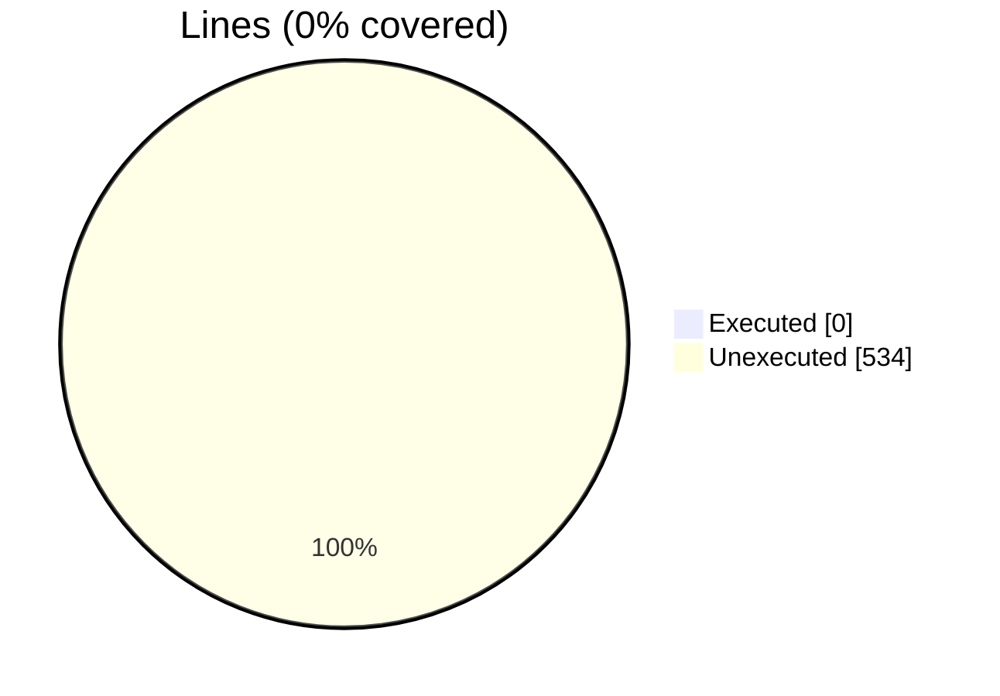
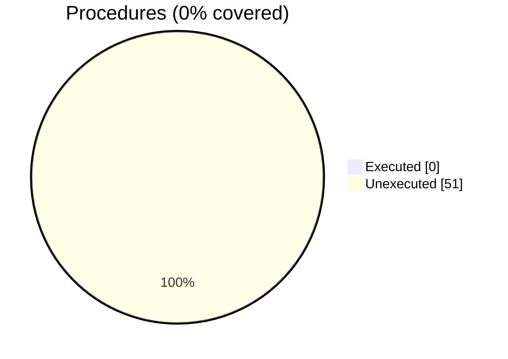

### Coverage analysis of *vtk_fortran_vtk_file_xml_writer_ascii_local.f90*

|Lines| | |
| --- | --- | --- |
|Executable lines            |534| |
|Executed lines              |0|0%|
|Unexecuted lines            |534|100%|
|Average hits / executed     |0| |

|Procedures| | |
| --- | --- | --- |
|Total procedures            |51| |
|Executed procedures         |0|0%|
|Unexecuted procedures       |51|100%|
|Average hits / executed     |0| |

#### Unexecuted procedures

 + *function* **finalize**, line 96
 + *function* **initialize**, line 70
 + *function* **write_dataarray1_rank1_I1P**, line 203
 + *function* **write_dataarray1_rank1_I2P**, line 184
 + *function* **write_dataarray1_rank1_I4P**, line 165
 + *function* **write_dataarray1_rank1_I8P**, line 146
 + *function* **write_dataarray1_rank1_R4P**, line 127
 + *function* **write_dataarray1_rank1_R8P**, line 108
 + *function* **write_dataarray1_rank2_I1P**, line 337
 + *function* **write_dataarray1_rank2_I2P**, line 314
 + *function* **write_dataarray1_rank2_I4P**, line 291
 + *function* **write_dataarray1_rank2_I8P**, line 268
 + *function* **write_dataarray1_rank2_R4P**, line 245
 + *function* **write_dataarray1_rank2_R8P**, line 222
 + *function* **write_dataarray1_rank3_I1P**, line 475
 + *function* **write_dataarray1_rank3_I2P**, line 452
 + *function* **write_dataarray1_rank3_I4P**, line 429
 + *function* **write_dataarray1_rank3_I8P**, line 406
 + *function* **write_dataarray1_rank3_R4P**, line 383
 + *function* **write_dataarray1_rank3_R8P**, line 360
 + *function* **write_dataarray1_rank4_I1P**, line 613
 + *function* **write_dataarray1_rank4_I2P**, line 590
 + *function* **write_dataarray1_rank4_I4P**, line 567
 + *function* **write_dataarray1_rank4_I8P**, line 544
 + *function* **write_dataarray1_rank4_R4P**, line 521
 + *function* **write_dataarray1_rank4_R8P**, line 498
 + *function* **write_dataarray3_rank1_I1P**, line 741
 + *function* **write_dataarray3_rank1_I2P**, line 720
 + *function* **write_dataarray3_rank1_I4P**, line 699
 + *function* **write_dataarray3_rank1_I8P**, line 678
 + *function* **write_dataarray3_rank1_R4P**, line 657
 + *function* **write_dataarray3_rank1_R8P**, line 636
 + *function* **write_dataarray3_rank3_I1P**, line 867
 + *function* **write_dataarray3_rank3_I2P**, line 846
 + *function* **write_dataarray3_rank3_I4P**, line 825
 + *function* **write_dataarray3_rank3_I8P**, line 804
 + *function* **write_dataarray3_rank3_R4P**, line 783
 + *function* **write_dataarray3_rank3_R8P**, line 762
 + *function* **write_dataarray6_rank1_I1P**, line 1008
 + *function* **write_dataarray6_rank1_I2P**, line 984
 + *function* **write_dataarray6_rank1_I4P**, line 960
 + *function* **write_dataarray6_rank1_I8P**, line 936
 + *function* **write_dataarray6_rank1_R4P**, line 912
 + *function* **write_dataarray6_rank1_R8P**, line 888
 + *function* **write_dataarray6_rank3_I1P**, line 1152
 + *function* **write_dataarray6_rank3_I2P**, line 1128
 + *function* **write_dataarray6_rank3_I4P**, line 1104
 + *function* **write_dataarray6_rank3_I8P**, line 1080
 + *function* **write_dataarray6_rank3_R4P**, line 1056
 + *function* **write_dataarray6_rank3_R8P**, line 1032
 + *subroutine* **write_dataarray_appended**, line 1177

#### Executed procedures

 + *none*

 --- 
 Report generated by [FoBiS.py](https://github.com/szaghi/FoBiS)