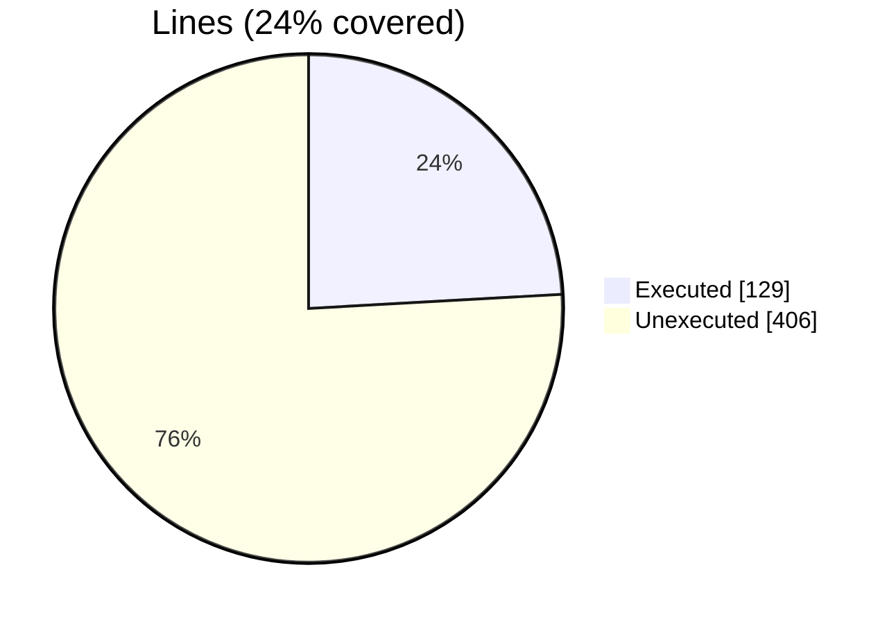
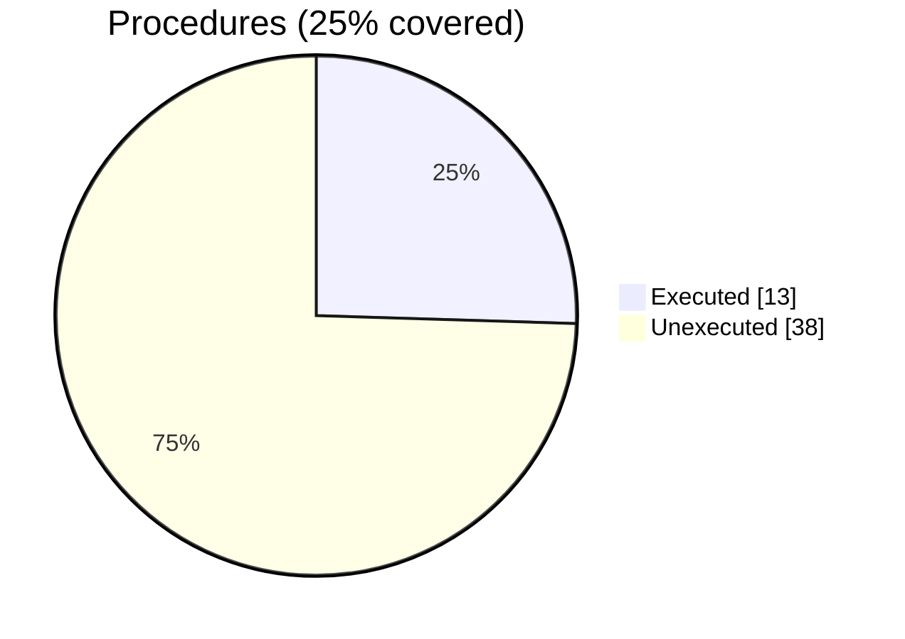

### Coverage analysis of *vtk_fortran_vtk_file_xml_writer_binary_local.f90*

|Lines| | |
| --- | --- | --- |
|Executable lines            |535| |
|Executed lines              |129|24%|
|Unexecuted lines            |406|76%|
|Average hits / executed     |4.790697674418604| |

|Procedures| | |
| --- | --- | --- |
|Total procedures            |51| |
|Executed procedures         |13|25%|
|Unexecuted procedures       |38|75%|
|Average hits / executed     |5.3076923076923075| |

#### Unexecuted procedures

 + *function* **write_dataarray1_rank1_I2P**, line 191
 + *function* **write_dataarray1_rank1_R4P**, line 134
 + *function* **write_dataarray1_rank2_I1P**, line 344
 + *function* **write_dataarray1_rank2_I2P**, line 321
 + *function* **write_dataarray1_rank2_I4P**, line 298
 + *function* **write_dataarray1_rank2_I8P**, line 275
 + *function* **write_dataarray1_rank2_R4P**, line 252
 + *function* **write_dataarray1_rank2_R8P**, line 229
 + *function* **write_dataarray1_rank3_I1P**, line 482
 + *function* **write_dataarray1_rank3_I2P**, line 459
 + *function* **write_dataarray1_rank3_I8P**, line 413
 + *function* **write_dataarray1_rank3_R4P**, line 390
 + *function* **write_dataarray1_rank4_I1P**, line 620
 + *function* **write_dataarray1_rank4_I2P**, line 597
 + *function* **write_dataarray1_rank4_I4P**, line 574
 + *function* **write_dataarray1_rank4_I8P**, line 551
 + *function* **write_dataarray1_rank4_R4P**, line 528
 + *function* **write_dataarray1_rank4_R8P**, line 505
 + *function* **write_dataarray3_rank1_I1P**, line 748
 + *function* **write_dataarray3_rank1_I2P**, line 727
 + *function* **write_dataarray3_rank1_I8P**, line 685
 + *function* **write_dataarray3_rank3_I1P**, line 874
 + *function* **write_dataarray3_rank3_I2P**, line 853
 + *function* **write_dataarray3_rank3_I4P**, line 832
 + *function* **write_dataarray3_rank3_I8P**, line 811
 + *function* **write_dataarray3_rank3_R4P**, line 790
 + *function* **write_dataarray6_rank1_I1P**, line 1015
 + *function* **write_dataarray6_rank1_I2P**, line 991
 + *function* **write_dataarray6_rank1_I8P**, line 943
 + *function* **write_dataarray6_rank1_R4P**, line 919
 + *function* **write_dataarray6_rank1_R8P**, line 895
 + *function* **write_dataarray6_rank3_I1P**, line 1159
 + *function* **write_dataarray6_rank3_I2P**, line 1135
 + *function* **write_dataarray6_rank3_I4P**, line 1111
 + *function* **write_dataarray6_rank3_I8P**, line 1087
 + *function* **write_dataarray6_rank3_R4P**, line 1063
 + *function* **write_dataarray6_rank3_R8P**, line 1039
 + *subroutine* **write_dataarray_appended**, line 1183

#### Executed procedures

 + *function* **write_dataarray1_rank1_R8P**: tested **18** times
 + *function* **initialize**: tested **9** times
 + *function* **finalize**: tested **9** times
 + *function* **write_dataarray1_rank1_I4P**: tested **8** times
 + *function* **write_dataarray3_rank3_R8P**: tested **6** times
 + *function* **write_dataarray1_rank1_I8P**: tested **4** times
 + *function* **write_dataarray3_rank1_R4P**: tested **4** times
 + *function* **write_dataarray1_rank1_I1P**: tested **2** times
 + *function* **write_dataarray1_rank3_I4P**: tested **2** times
 + *function* **write_dataarray3_rank1_R8P**: tested **2** times
 + *function* **write_dataarray3_rank1_I4P**: tested **2** times
 + *function* **write_dataarray6_rank1_I4P**: tested **2** times
 + *function* **write_dataarray1_rank3_R8P**: tested **1** times

 --- 
 Report generated by [FoBiS.py](https://github.com/szaghi/FoBiS)