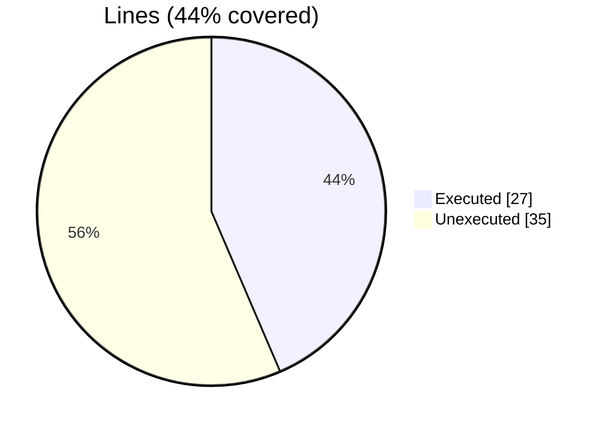
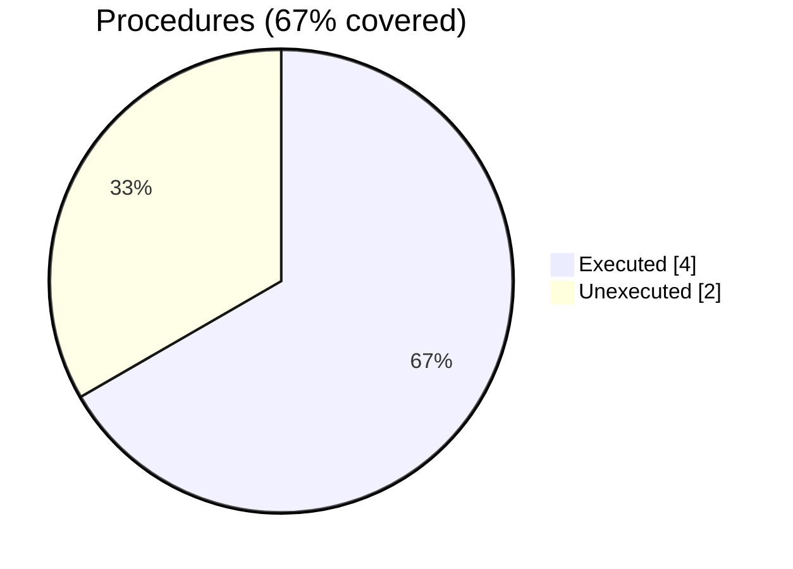

### Coverage analysis of *vtk_fortran_vtm_file.F90*

|Lines| | |
| --- | --- | --- |
|Executable lines            |62| |
|Executed lines              |27|44%|
|Unexecuted lines            |35|56%|
|Average hits / executed     |1.4444444444444444| |

|Procedures| | |
| --- | --- | --- |
|Total procedures            |6| |
|Executed procedures         |4|67%|
|Unexecuted procedures       |2|33%|
|Average hits / executed     |1.5| |

#### Unexecuted procedures

 + *function* **parse_scratch_files**, line 129
 + *function* **write_block_scratch**, line 162

#### Executed procedures

 + *function* **finalize**: tested **2** times
 + *function* **write_block_array**: tested **2** times
 + *function* **initialize**: tested **1** times
 + *function* **write_block_string**: tested **1** times

 --- 
 Report generated by [FoBiS.py](https://github.com/szaghi/FoBiS)