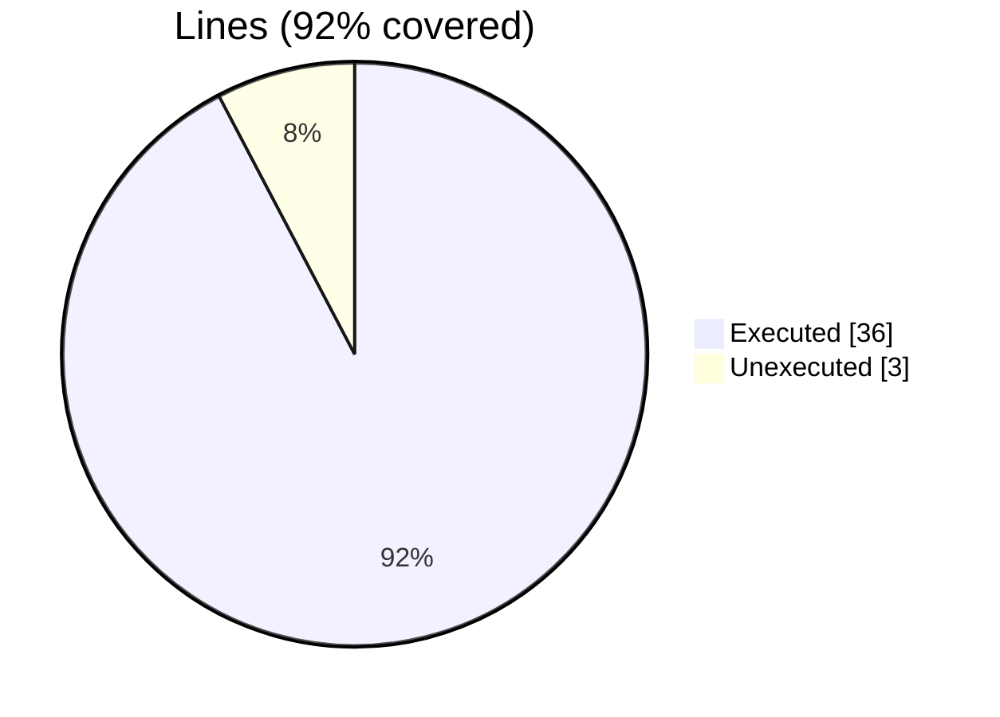
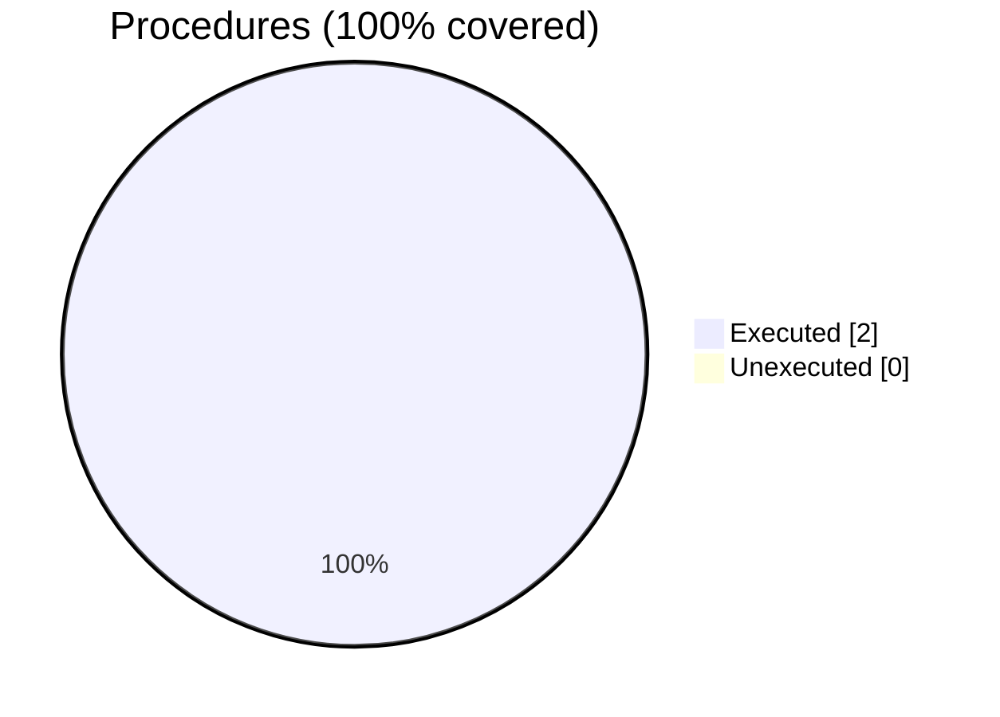

### Coverage analysis of *vtk_fortran_write_pvts.f90*

|Lines| | |
| --- | --- | --- |
|Executable lines            |39| |
|Executed lines              |36|92%|
|Unexecuted lines            |3|8%|
|Average hits / executed     |88.41666666666667| |

|Procedures| | |
| --- | --- | --- |
|Total procedures            |2| |
|Executed procedures         |2|100%|
|Unexecuted procedures       |0|0%|
|Average hits / executed     |1.5| |

#### Unexecuted procedures

 + *none*

#### Executed procedures

 + *subroutine* **write_vts**: tested **2** times
 + *subroutine* **write_pvts**: tested **1** times

 --- 
 Report generated by [FoBiS.py](https://github.com/szaghi/FoBiS)