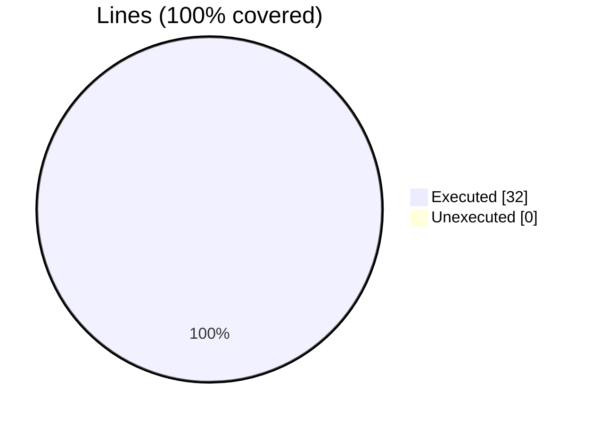

### Coverage analysis of *vtk_fortran_write_vtr.f90*

|Lines| | |
| --- | --- | --- |
|Executable lines            |32| |
|Executed lines              |32|100%|
|Unexecuted lines            |0|0%|
|Average hits / executed     |495.03125| |

#### Unexecuted procedures

 + *none*

#### Executed procedures

 + *none*

 --- 
 Report generated by [FoBiS.py](https://github.com/szaghi/FoBiS)