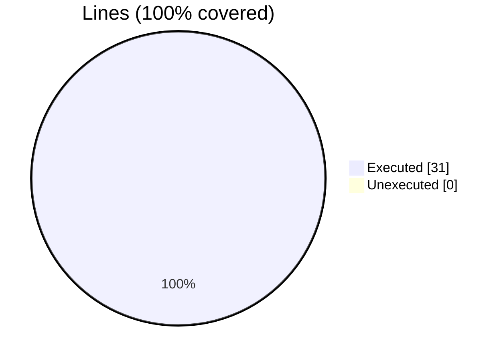
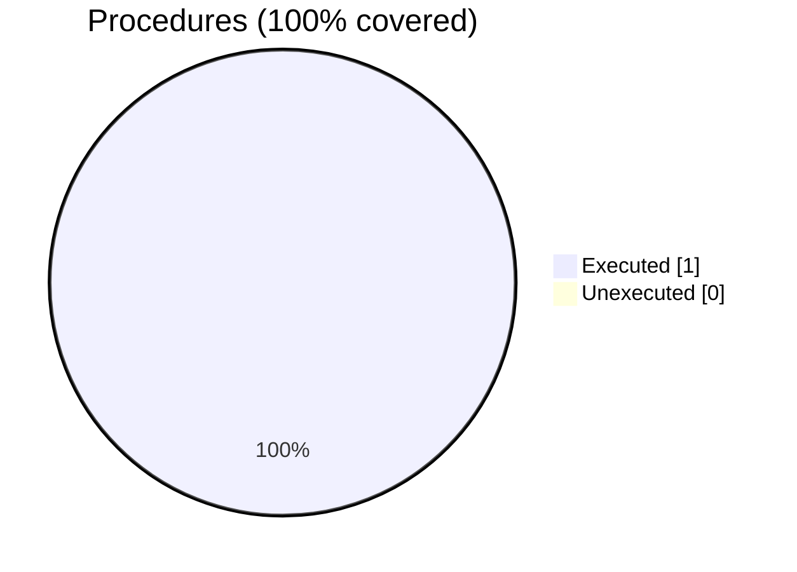

### Coverage analysis of *vtk_fortran_write_vts.f90*

|Lines| | |
| --- | --- | --- |
|Executable lines            |31| |
|Executed lines              |31|100%|
|Unexecuted lines            |0|0%|
|Average hits / executed     |115.12903225806451| |

|Procedures| | |
| --- | --- | --- |
|Total procedures            |1| |
|Executed procedures         |1|100%|
|Unexecuted procedures       |0|0%|
|Average hits / executed     |2.0| |

#### Unexecuted procedures

 + *none*

#### Executed procedures

 + *subroutine* **write_data**: tested **2** times

 --- 
 Report generated by [FoBiS.py](https://github.com/szaghi/FoBiS)