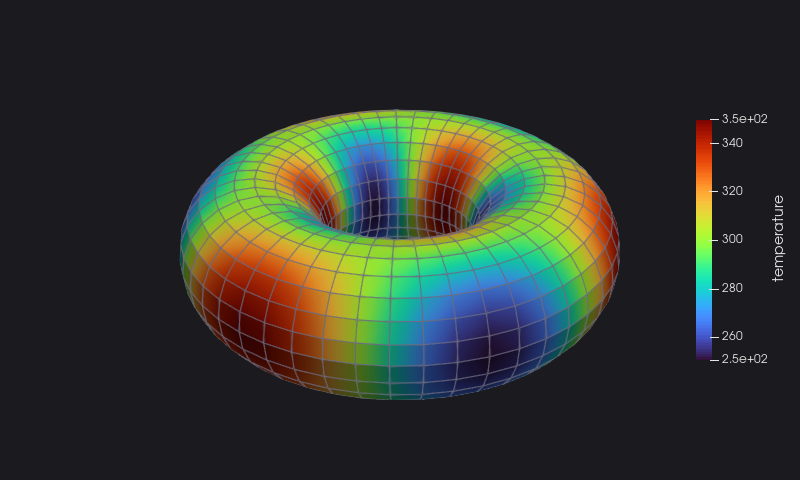
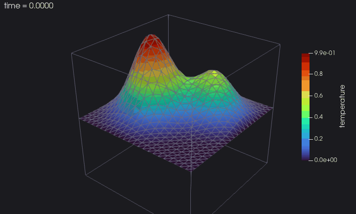
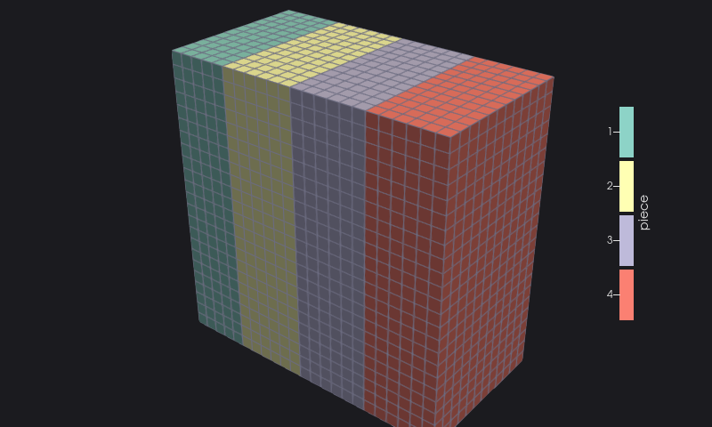
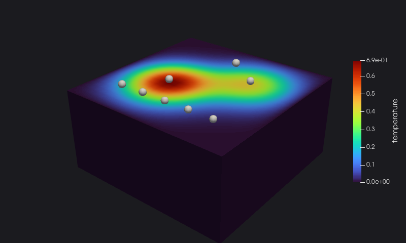

## Quick start

A real session: a short program writes a torus as a structured grid with a temperature and a velocity field, then a
second one reads the file back and prints what it holds.

This is the whole program: compute the points and the fields, then one call for each part of the file. The torus above
is `torus.vts` opened in ParaView.

<<< @/examples/snippets/quickstart.f90

Reading is as short: `initialize` with `action='read'`, then ask for what you need. The `inspect` program of the session:

<<< @/examples/snippets/inspect.f90

Every example on these pages is a program compiled and run to produce the output and the images shown.

## Grows with your simulation

From a first file to a parallel, restartable time series: the [tutorial](/manual/tutorial/01-first-file) builds `heat`, a
small solver of the heat equation, chapter by chapter. This is its time series played in ParaView: two hot blobs merging
and cooling down, on the middle plane of the cube.

| | |
|---|---|
|  |  |
| [Parallel pieces](/manual/tutorial/06-parallel), ghost cells and a checked header | [An assembly](/manual/tutorial/07-assembly) of the domain and its probes |

## Authors

- Stefano Zaghi — [@szaghi](https://github.com/szaghi)

Contributions are welcome — see the [Contributing](/guide/contributing) page.

## Copyrights

VTKFortran is distributed under a multi-licensing system:

| Use case | License |
|----------|---------|
| FOSS projects | [GPL v3](http://www.gnu.org/licenses/gpl-3.0.html) |
| Closed source / commercial | [BSD 2-Clause](http://opensource.org/licenses/BSD-2-Clause) |
| Closed source / commercial | [BSD 3-Clause](http://opensource.org/licenses/BSD-3-Clause) |
| Closed source / commercial | [MIT](http://opensource.org/licenses/MIT) |

> Anyone interested in using, developing, or contributing to VTKFortran is welcome — pick the license that best fits your needs.
