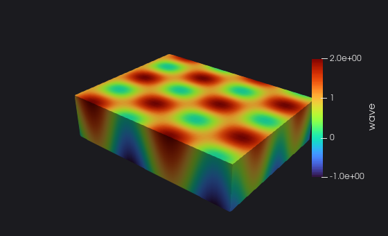
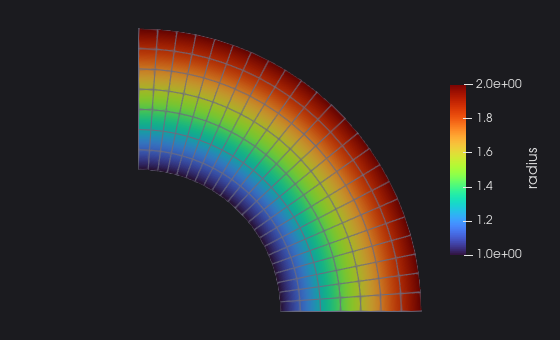
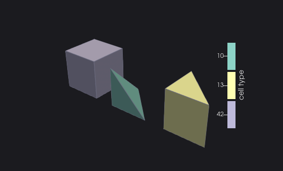
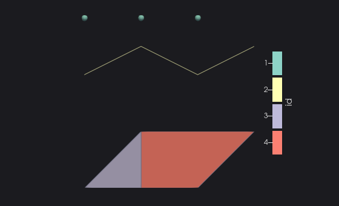

# Cookbook

Short answers to "how do I ...?". Each recipe is a complete program with its real output; the
[reference](/guide/features) has the details, the [tutorial](./tutorial/01-first-file) the whole story.

[[toc]]

## Write each kind of dataset

### A regular grid (ImageData)

No coordinates at all: the points are defined by the extent, an origin and a spacing.

<<< @/examples/snippets/image_data.f90

<<< @/examples/output/image_data.ansi{ansi}

`direction` (a row-major 3x3 matrix) rotates the axes of the grid. In a parallel `.pvti`, every piece has the same origin
and spacing.

### A curvilinear grid (StructuredGrid)

Every point has its own coordinates, the topology is still that of a box: `write_geo(n, x, y, z)` with rank-3 arrays.

<<< @/examples/snippets/curvilinear.f90

<<< @/examples/output/curvilinear.ansi{ansi}

### Cells of any type, polyhedra included (UnstructuredGrid)

`cell_type` gives the VTK type of each cell, `offset` the end of each cell in `connect`. A polyhedron (type 42) also needs
its faces: `face` and `faceoffset`, `-1` for the cells that are not polyhedra.

<<< @/examples/snippets/polyhedron.f90

<<< @/examples/output/polyhedron.ansi{ansi}

### Points, lines and polygons (PolyData)

Up to four blocks of cells: vertices, lines (polylines), triangle strips, polygons. Pass only the blocks you have.

<<< @/examples/snippets/polydata.f90

<<< @/examples/output/polydata.ansi{ansi}

The cell data follow the VTK order of the blocks: vertices, lines, strips, polygons.

## Write data

### Scalars, vectors and tensors

A vector by its components, `x`, `y`, `z`; any number of components as a rank-2 array `(components, points)`: 6 for a
symmetric tensor (xx, yy, zz, xy, yz, xz), 9 for a full one.

<<< @/examples/snippets/vectors_tensors.f90

<<< @/examples/output/vectors_tensors-inspect.ansi{ansi}

`scalars`, `vectors` and `tensors` choose the arrays readers use by default. `inspect` is the program of the
[quick start](/#quick-start).

### Time, cycle and other global data

<<< @/examples/snippets/field_data.f90

<<< @/examples/output/field_data.ansi{ansi}

Field data are written right after `initialize`, before the first piece: scalars and rank-1 arrays of any kind, strings and
arrays of strings (trailing blanks trimmed).

### Ghost cells and other unsigned arrays

<<< @/examples/snippets/ghost_cells.f90

<<< @/examples/output/ghost_cells.ansi{ansi}

`write_dataarray_unsigned` writes `I1P`...`I8P` arrays as `UInt8`...`UInt64`. In `vtkGhostType`, `1` marks a duplicate cell
and `32` a hidden one: ParaView does not draw them.

## Choose the format

### Compress, and go beyond 2 GiB

<<< @/examples/snippets/compress.f90

<<< @/examples/output/compress.ansi{ansi}

`compressor='zlib'` needs the library built with zlib: `initialize` returns an error otherwise, the time to fall back to an
uncompressed format. `header_type='UInt64'` is needed only for arrays of more than 2 GiB. The sizes of each format are
measured in [chapter 2](./tutorial/02-formats) of the tutorial.

### More than 2^31 points or cells

<<< @/examples/snippets/ids_64bit.f90

<<< @/examples/output/ids_64bit-grep.ansi{ansi}

The kind of the counts and ids selects the version: `I4P` calls are unchanged.

### Several pieces in one file

<<< @/examples/snippets/pieces_in_file.f90

<<< @/examples/output/pieces_in_file-inspect.ansi{ansi}

Readers merge the pieces into one dataset. Every piece must hold the same arrays.

## Parallel and composite files

### A partitioned structured grid (.pvts)

<<< @/examples/snippets/pvts.f90

<<< @/examples/output/pvts.ansi{ansi}

The same for `.pvtr` (`PRectilinearGrid`) and `.pvti` (`PImageData`, with origin and spacing); unstructured pieces
(`.pvtu`, `.pvtp`) have no extent, see [chapter 6](./tutorial/06-parallel).

### Check a parallel header against its pieces

<<< @/examples/snippets/check_pieces.f90

<<< @/examples/output/check_pieces.ansi{ansi}

### Continue a time series after a restart

<<< @/examples/snippets/pvd_append.f90

<<< @/examples/output/pvd_append.ansi{ansi}

The collection is valid after every `write_dataset`: a job killed before `finalize` leaves a readable series.

### Assemblies of datasets (.vtm)

Blocks nested to any depth, read back with `get_entries`: see [chapter 7](./tutorial/07-assembly).

### Write a file into memory

<<< @/examples/snippets/volatile.f90

<<< @/examples/output/volatile.ansi{ansi}

For the processes that cannot access the file system: the `binary` and `ascii` formats support volatile files; the
appended ones (`raw`, `raw-zlib`, `binary-appended`) write their data to the file directly, and `initialize` refuses them.

## Read files

### What a file holds

`inspect`, the program of the [quick start](/#quick-start), lists the pieces and the arrays of any file, with their range.

### Read one array

<<< @/examples/snippets/read_array.f90

<<< @/examples/output/read_array.ansi{ansi}

The output kind must hold every value of the type: an error 5 otherwise. Unsigned types read into the signed kind of the
same width, with the same bits.

### Read the mesh

<<< @/examples/snippets/read_mesh.f90

<<< @/examples/output/read_mesh.ansi{ansi}

`vtk_tetra.vtu` was written by VTK (zlib compressed, base64 appended, UInt64 headers): the reader takes the format from
the file.

### Handle the errors

<<< @/examples/snippets/errors.f90

<<< @/examples/output/errors.ansi{ansi}

The codes of the readers: 1 the file cannot be read, 2 not a VTK XML file, 3 an unsupported feature, 4 not found, 5 a kind
that cannot hold the values, 6 data that do not decode, 7 pieces that do not match their header.
