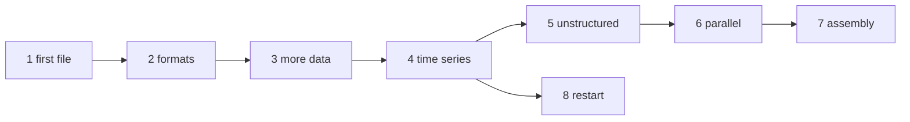

# The tutorial

The tutorial teaches VTKFortran by building one program, step by step: `heat`, a small solver of the heat equation in a
cube, whose output grows from a first file to a parallel, restartable time series. The [cookbook](./cookbook) then
collects short recipes, and the [reference](/guide/features) has every procedure and every argument.

## The chapters

Two hot blobs cool down in a cube whose walls are kept at zero temperature: 24 points along each side, explicit time
steps. The physics takes a dozen lines and stays the same in every chapter; what changes is how the solution is written.
Each chapter is a complete program that you can compile and run; every output and every picture shown is the real output
of that program, the pictures rendered by ParaView from the files it writes.

| Chapter | You learn |
|---|---|
| [1. A first file](./tutorial/01-first-file) | `vtk_file`, a rectilinear grid, point data, the ASCII format |
| [2. Formats](./tutorial/02-formats) | binary, raw and base64 appended data, zlib compression: what each format costs |
| [3. More data](./tutorial/03-more-data) | vectors, field data (time and cycle), the active arrays of a reader |
| [4. A time series](./tutorial/04-time-series) | one file per output, `pvd_file`: the series ParaView plays |
| [5. An unstructured mesh](./tutorial/05-unstructured) | points, hexahedra, connectivity, cell data |
| [6. Going parallel](./tutorial/06-parallel) | pieces written by each process, a `.pvtu` header, ghost cells, `check_pieces` |
| [7. An assembly](./tutorial/07-assembly) | polydata probes, a multi-block `.vtm` with nested blocks, read back |
| [8. Restart](./tutorial/08-restart) | read the last file of the series and continue it, appending to the collection |



## The cookbook

[The cookbook](./cookbook) answers "how do I ...?" in a few lines each: write each kind of dataset, vectors and tensors,
field data, ghost cells, compression, 64-bit ids, parallel headers and their check, restarts, files in memory, and reading
arrays, meshes and files written by VTK.

## Building the examples

Every program of the tutorial and of the cookbook is in [`docs/examples/src`](https://github.com/szaghi/VTKFortran/tree/master/docs/examples/src).
With VTKFortran built by FoBiS with zlib (`fobis build --mode static-gnu-zlib`, see [Installation](/guide/installation)):

```bash
gfortran -I static/mod docs/examples/src/heat_1.f90 static/libvtkfortran.a -lz -o heat
./heat
```

`scripts/docs_examples.sh` builds and runs them all, as the documentation does.
