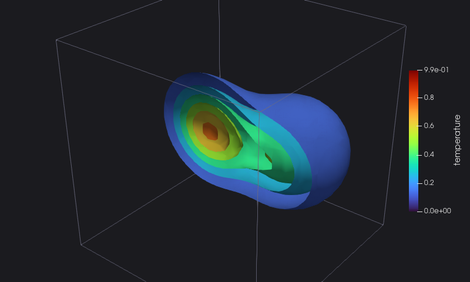

# 1. A first file

`heat` starts from the initial temperature: two hot blobs in a cold cube, sampled at 24 points along each side. The
points are aligned along the axes, so the cube is a **rectilinear grid**: the coordinates along each axis are enough to
define all the points.

<<< @/examples/snippets/heat_1-initial.f90

Writing it takes one call for each part of the file:

<<< @/examples/snippets/heat_1-write.f90

- `initialize` opens the file: the format (`ascii` here, human readable), the file name, the type of the dataset
  (`mesh_topology`) and its whole extent, the range of the point indexes along each axis.
- A file holds one or more **pieces**: `write_piece` with the extent opens one, `write_piece()` without arguments closes
  it.
- `write_geo` writes the geometry; for a rectilinear grid, the coordinates along each axis.
- The point data are written between an `open` and a `close` of the `node` location; `write_dataarray` accepts arrays of
  rank 1 to 4: `one_component=.true.` says that the rank-3 `t` is one scalar per point, not a vector.
- `finalize` closes the file. Every procedure returns an error status: 0 means success.

The whole program:

::: details heat_1.f90
<<< @/examples/snippets/heat_1.f90
:::

## Running it

<<< @/examples/output/heat_1.ansi{ansi}

The file is plain XML; its head:

<<< @/examples/output/heat_1-head.ansi{ansi}

Opened in ParaView (here with a few isosurfaces of the temperature, cut in half):

::: tip What you learned
A file is `initialize`, then pieces with their geometry and data, then `finalize`. Reference:
[Rectilinear Grid](/guide/topologies#rectilinear-grid-vtr).
:::

Next: [2. Formats](./02-formats).
