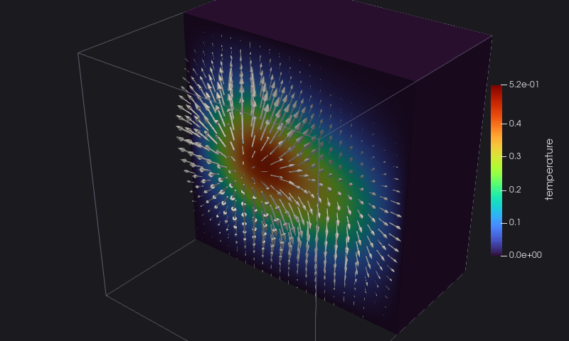

# 3. More data

The solver now advances the temperature by 20 explicit time steps, and computes the heat flux, minus the gradient of the
temperature:

<<< @/examples/snippets/heat_3-step.f90

The file gets more than the temperature:

<<< @/examples/snippets/heat_3-write.f90

- **Field data** belong to the whole dataset, not to points or cells: the time and the cycle of the solution, written
  right after `initialize`. Any kind and rank-1 arrays, strings too.
- **Vectors**: `write_dataarray` with `x`, `y`, `z` writes a 3-component array, here the heat flux at each point.
- **Active arrays**: `scalars='temperature'` and `vectors='heat_flux'` tell readers which arrays to use by default, to
  colour the dataset and to draw arrows.

::: details heat_3.f90
<<< @/examples/snippets/heat_3.f90
:::

## Running it

<<< @/examples/output/heat_3.ansi{ansi}

The temperature on a cut of the cube, with the heat flux flowing out of the blobs:

::: tip What you learned
`write_fielddata` for global values, `write_dataarray(x, y, z)` for vectors, the active arrays chosen when opening the data.
Reference: [Field data](/guide/data#field-data-global-metadata), [Active arrays](/guide/data#active-arrays).
:::

Next: [4. A time series](./04-time-series).
