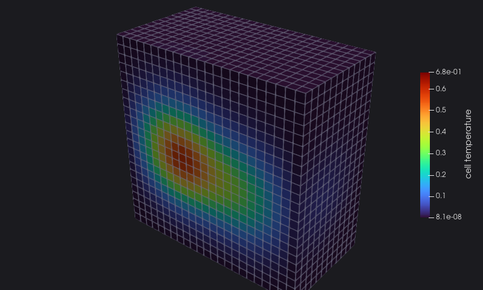

# 5. An unstructured mesh

Real meshes are rarely boxes. An **unstructured grid** lists its points one by one and its cells by the ids of their
points, so any shape fits: here the same cube, as 12167 hexahedra, a step toward the meshes of a real solver.

<<< @/examples/snippets/heat_5-mesh.f90

- The points are numbered from 0; each cell lists its points in the order VTK expects for its type (a hexahedron, type
  12: the bottom face, then the top face).
- `offset` is the end of each cell in `connect`; with cells of different types, it is how the reader splits the list.
- The cell data have one value per cell: here the mean temperature of its points.

<<< @/examples/snippets/heat_5-write.f90

::: details heat_5.f90
<<< @/examples/snippets/heat_5.f90
:::

## Running it

<<< @/examples/output/heat_5.ansi{ansi}

The cells, coloured by their temperature, cut in half:

::: tip What you learned
Points, connectivity, offsets and types make an unstructured grid; cell data are written between `open` and `close` of the
`cell` location. Reference: [Unstructured Grid](/guide/usage#unstructured-grid-vtu).
:::

Next: [6. Going parallel](./06-parallel).
