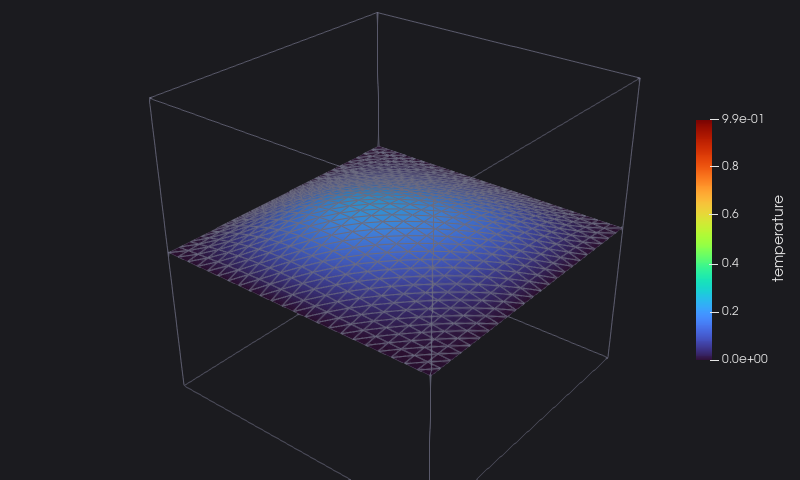

# 8. Restart

A long run is split in jobs: each one restarts from the last output of the previous one. `heat` reads the collection of
chapter 4, takes its last file, and reads the grid, the temperature, the time and the cycle back:

<<< @/examples/snippets/heat_8-restart.f90

- `pvd_file` with `action='read'` returns the time steps and the files of the collection.
- `vtk_file` with `action='read'` indexes the file without loading it; each `read_*` then loads one array: the
  coordinates, the temperature (flattened: `reshape` it back), the field data.

Then it continues the run, appending the new outputs to the same collection:

<<< @/examples/snippets/heat_8-continue.f90

::: details heat_8.f90
<<< @/examples/snippets/heat_8.f90
:::

## Running it

<<< @/examples/output/heat_8.ansi{ansi}

The end of the collection, with the restarted outputs:

<<< @/examples/output/heat_8-pvd.ansi{ansi}

The last output, on the same scale as the animation of chapter 4: the cube has almost cooled down.

::: tip What you learned
Every file VTKFortran writes can be read back: `action='read'`, then `read_geo`, `read_dataarray` and the other readers;
`pvd_file` reads and appends to a collection. Reference: [Reading files](/guide/usage#reading-files),
[Multi-block and time series files](/guide/usage#multi-block-and-time-series-files).
:::

This is the end of the tutorial: the [reference](/guide/features) has every procedure and argument.
